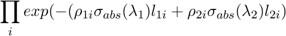

Monte Carlo Absorption Correction Procedure
-------------------------------------------

This document describes the intended procedure for calculating the correction factors due
to attenuation & single scattering within a sample plus its sample environment.

The algorithm will compute the correction factors on a bin-by-bin basis for each spectrum within
the input workspace. The following assumptions on the input workspace will be made:

* X units are in wavelength
* the instrument is fully defined
* a shape & material for the sample has been defined
* the "size" of the beam has been defined. Currently assumed to be a width & height with no divergence
* a series of shapes & materials for the can + other sample environment components is defined  (optional)

The additional inputs to the algorithm are:

* `NumberOfWavelengthPoints` - the number of wavelength points per spectrum for which to calculate the correction factor. An interpolation
                             will fill in the missing values
* `NEvents` - the number of monte carlo "events" to generate for each simulated wavelength point

The algorithm will proceed as follows. For each spectrum:

1. find the associated detector position
1. find the associated efixed value (if applicable) & convert to wavelength (`lambdaFixed`)
1. loop over the bins in steps defined by `NumberOfWavelengthPoints` and for each step (`lambdaStep`)
    * define `lambda_1` as the wavelength before scattering & `lambda_2` as wavelength after scattering:
      - Direct: `lambda_1` = `lambda_1`, `lambda_2` = `lambdaStep`
      - Indirect: `lambda_1` = `lambdaStep`, `lambda_2` = `lambdaFixed`
      - Elastic: `lambda_1` = `lambda_2` = `lambdaStep`
    * for each event in `NEvents`:
      - generate a random point on the beam face define by the input height & width
	  - assume the neutron travels in the direction defined by the `samplePos - srcPos` and define a `Track`
	  - test for intersections of the track & sample + container objects, giving the number of subsections
	    and corresponding distances within the object for each section, call them `l_1i`
      - choose a random section and depth for the scatter point
      - form a second `Track` with the scatter position as the starting point and the direction defined by
        `detPos - scatterPos`
      - test for intersections of the track & sample + container objects, giving the number of subsections
	    and corresponding distances within the object for each section, call them `l_2i`
      - compute the self-attenuation factor for all intersections as
      
	   where rho is the mass density of the material & sigma_abs the absorption cross-section at a given wavelength
	  - accumulate this factor with the factor for all `NEvents`
	* average the accumulated attentuation factors over `NEvents` and assign this as the correction factor for this `lambdaStep`. The error is 1/sqrt(NEvents).
1. finally, perform an interpolation through the unsimulated wavelength points
