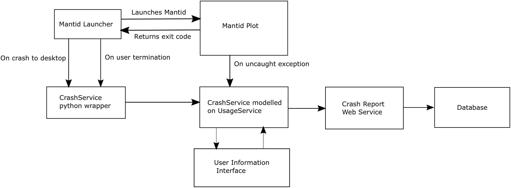

# Crash reporting

## Motivation/Introduction

Stability and reliability are consistently amongst the most desired improvements cited by Mantid users. In order to tackle the issues surrounding the stability and reliability of the current code, we first need to understand *quantitatively* the types of problems that are being encountered by users. 

Currently we have several mechanisms for users to provide details of problems with Mantid. These include the online forum ([http://forum.mantidproject.org/](http://forum.mantidproject.org/)), users meetings and direct correspondence between developers and users. These can, at best, be described as semi-quantitative.

To obtain truly quantitative information about Mantid issues, we intend to implement a crash reporting system. The reporting system is intended to allow users to report details of encountered issues, with minimal friction and to collate the information in a centralised, structured location, facilitating analysis and ultimately enabling informed development decisions. 

The key information that we want to capture is:

* Frequency of issues
* Types of issues
* As much information about causes of the issues as possible

Concerns that we need to bear in mind are:

* Data security/privacy
* Reducing the reporting burden on the user

## Timescales

We would like to have an initial version of the "Crash Reporter" in the next release of Mantid. Although it is unlikely to be possible to include all desired functionality by this time, we are confident that a level of crash reporting will be possible which should allow us to assess certain metrics, such as crash frequency. Further details are outlined in the 'Requirements' section.

## Requirements

#### Necessity

* M : Mandatory
* D : Desirable
* O : Optional

The "Desirable" necessity is something which might not get addressed in the
the very first iteration of the the implementation, but should eventually be
provided.

### High Level Requirements

#### Functional requirements

 Label  | Requirement    |   Necessity |
|--------|----------------|-------------|
| R.1.1  | Uncaught exceptions are reported back as crashes  | M |
| R.1.2  | User hard terminations i.e. via task manager are reported as crashes | M |
| R.1.3  | Catastrophic failures are reported back as crashes | M |
| R.1.4  | Stores crash reports in a queryable database | M|
| R.1.5  | Where possible asks the user for further information about crash | D|
| R.1.5  | Sends a textdump of the end of the log file along with the crash report | D|
| R.1.6  | Obtains additional information about the crash and sends it along with crash report | D|

#### Non-functional requirements 
Label  | Requirement    |   Necessity |
|--------|----------------|-------------|
| R.3.1  | Must comply with Mantid's stated privacy policy | M |
| R.3.2  | Must be forward compatible with the Mantid workbench | M |

## Backend Design

### Overview

The major segments that need to be implemented in order to report crashes are: 
* A method to detect when Mantid has crashed, it is proposed this is done within the launcher scripts.
* A service to gather further information and then send these crashes to the web service. 
* An interface to ask the user for additional information on these crashes. 
* A webservice and database.  

### Crash detection
There are three major sorts of crashes which we wish to report with the handler.  

##### 1. Uncaught exceptions

 These occur when an exception propagates all the way up to the last chance error handler. Whilst it is possible to continue using Mantid after this the uncertain state of the system means that it is not recommended so it is treated like a crash.
Detecting this sort of crash is already done as they are caught by the last chance exception handler so we just need to call whatever code we implement to report the crashes from there. 

##### 2. Mantid unresponsive 

It has been assumed that when Mantid is unresponsive it will be manually terminated by the user. In Windows for example they might use task manager. This cannot be detected from within Mantid so it has been decided to implement an external launcher which can check how Mantid exits and if necessary call the crash reporting. This may lead to some false positives as users terminate Mantid unnecessarily but this level of noise in the reporting has been deemed acceptable.

##### 3. Crash to desktop

This will be detected in a similar way to the Mantid unresponsive case in that an external launcher will make note of how Mantid exits and if necessary call the crash reporter.  

##### Mantid Launcher

The Mantid Launcher should be lightweight and invisible to the user. On Windows and Linux Mantid is already launched via a batch and bash script respectively which can be extended upon to fulfil this purpose. 

Preliminary testing on Windows shows Mantid obeying the following exit code structure.

Situation  | Exit Code   |  
|--------|----------------|
| Exited without error  | 0 | 
| Force terminated  | 1 |
| Crash to Desktop  | Varies but not so far 0 or 1|

It should therefore be feasible to check the exit status of mantidplot and if necessary call the crash reporting implementation from within these scripts. A difficultly to keep in mind here however is that the crash reporting implementation in this instance needs to be called from outside Mantid.

* Q This appears from preliminary testing to be feasible but needs to be checked on other possible configurations as well.

### Crash Reporting
The crash reporting will be implemented in the kernel in a similar way to the existing Usage service. This should allow it to be launchable from outside mantiplot. ConfigService may need to be modified to allow a skinny version to be launched here that does not launch all the algorithms. 

This service can be exposed to the launcher either through mantidpython or an executable.

The main things that this service needs to do are:
* Check whether usage reporting is enabled and if not exit having done nothing.
* Launch the user interface, via either the python wrapper or mantidplot.
* Gather information on the crash
* Send crash report to web service

#### Information to gather

##### Minimal information
This is what will be gathered and sent if the mantiplot instance is not accessible and the user has opted to send no additional information.

Field  | Data Type   |  
|--------|----------------|
| Crash Type  | TINYTEXT | 
| Crash Time  | DATETIME |
| Facility  | TINYTEXT|
| Instrument  | TINYTEXT|
| Mantid Version  | TINYTEXT|
| Encrypted user ID  | TINYTEXT|
| Encrypted host ID  | TINYTEXT|

##### If mantidplot is open
Field  | Data Type   |  
|--------|----------------|
| List of open Interfaces  | ENUM | 
| Number of open graphs  | SMALLINT |
| Number of loaded workspaces  | SMALLINT|

##### If additional information is provided by user
Field  | Data Type   |  
|--------|----------------|
| User email address (if provided)  | TINYTEXT | 
| User phone number (if provided) | TINYTEXT |
| User feedback (if provided)  | TEXT|
| Last x characters of logfile  | TEXT|
| Unencrypted user ID  | TINYTEXT|
| Unencrypted host ID  | TINYTEXT|

##### If additional information is provided by user and mantidplot is open
Field  | Data Type   |  
|--------|----------------|
| MessageDialog text dump  | TEXT | 

### Web service and Database
We are initially planning to use the same web service and database for the crash reporting that we do for the usage reporting. The crash reports will go to a different url however so that we maintain the flexibility to change this in the future if required.

The data base for the crash reporting will be split into a table for the minimal data which is always provided and a table of extra data which will sometimes be provided. The minimal data will be that described above in the crash reporting section. Entries spanning these two tables can then be linked by a Crash ID.

### User feedback

As there is no guarantee that mantidplot will still be running at this point this interface needs to be independent of mantidplot and launchable on it's own. It will ideally be coded using pyqt and launched from within the crash reporting service, via either mantidplot or a python wrapper,  as this is the common point between all the different crash cases. 

The layout and usability of this interface is discussed below. 

## User Interface Design

### First screen

Apologises and seeks the users' permissions for reporting levels.

### Final screen

Thank the user for their effort.

