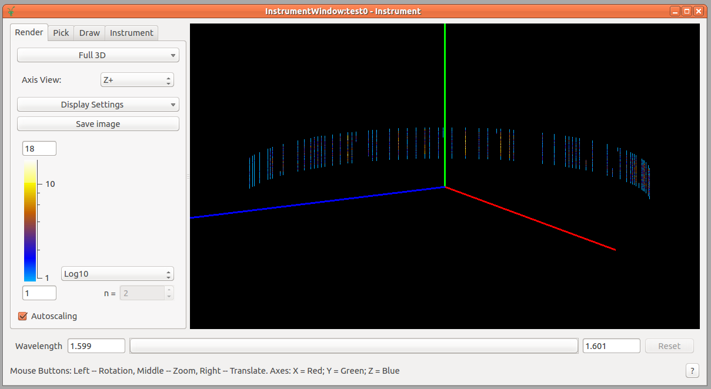
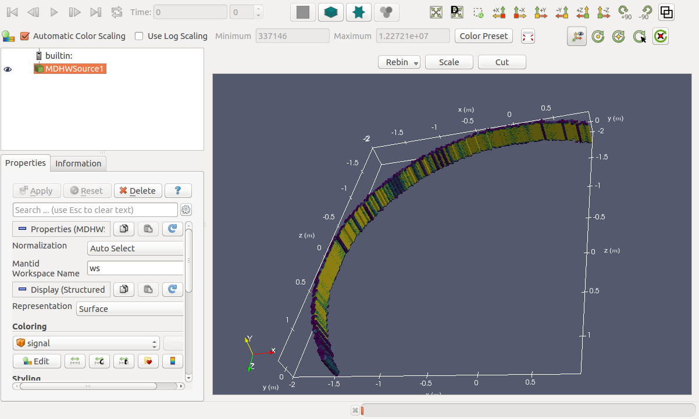

# Scanning Instruments for the ILL

## Introduction

Some details on requirements for the ILL were originally provided in a document from [development workshop discussions in 2015](https://github.com/mantidproject/documents/blob/master/Design/HandlingMovingInstruments.md).

The three instruments concerned with this work at ILL are D2B, D4 and D7. D16 also potentially has a similar mode to D4, and the TAS instruments should be kept in mind, although not in the scope of this work.

**Note:** These are some initial notes on the ILL instrument requirements. Some further validation and clarification of the requirements is still required.

## Requirements

### Mandatory
* A loader can load data from a single file, and create the workspace with the correct positions and rotations stored for each detector
* Multiple workspaces can be merged, with different sets of time indexes, and positions and rotations stored correctly for each detector
* Detector positions for a given time index can still be modified after loading
* Detector movement at the ILL is limited to the case of rotation around sample position - but full positional changes should be allowed, for example in case the sample is off-centre
* Flexible step scans are supported, times at a given position can differ, as can angular step size changes between steps
* Each spectrum ultimately links to a detector or detector group and a time index for scanning instruments
* A start and end time, as the full time and date, can be obtained for each time index
* Extra metadata can be accessed for a given position in the step scan - for example so normalisation to monitors can be performed later
* Metadata values that change in time can be shared appropriately between positions in the step scan (for example in D2B files each file contains a single value for monitor counts, but 25 different detector positions, so the monitor counts for each position might need to be divided by 25)
* Overlaps in detector positions are possible
* The instrument view shows every step position for each detector, and deals with overlapping detectors
* Saving/loading workspaces should deal with all of the information related to step scans

### Desirable
* Multiple workspaces can be merged with the same detector positions for certain time indexes - the data for spectra is then summed
* Masking of detectors at different time indexes

### Performance

One of the main aims of the Instrument 2.0 work is to eventually bring performance improvements to Mantid. Currently Instrument 2.0 exists as a [prototype](https://github.com/DMSC-Instrument-Data/instrument-prototype/) for benchmarking performance and the impact of design decisions.

The only requirement for the ILL to use scanning instruments is not to introduce any performance regressions. Otherwise the performance only needs to be the equivalent to that of having a larger instrument.

D2B represents the most difficult case for performance at the ILL, with 100 steps x 64 detectors x 256 pixels = 1,638,400 spectra.

### Not Required

Just for information these are things that are likely to be implemented and related to moving instruments. These are not currently ILL requirements, but might be in the future.

* Continuous scanning
* Triple axis spectrometers
* Components other than detectors can be time indexed
* Monitors should have a separate spectrum for each time index, even though they do not move, to allow correct normalisation

## Further Notes on Instruments

### D2B

[D2B](https://www.ill.eu/instruments-support/instruments-groups/instruments/d2b/) is a high-resolution two-axis diffractometer.

D2B is the most straightforward case. D2B is a high-resolution two-axis diffractometer with 64 detectors, each with 256 pixels (= 16384 spectra). A complete diffraction pattern is obtained by 100 steps of 0.025&deg; as the detectors are spaced at 2.5&deg; intervals. One numor contains data from 25 detector positions. The base position is given as the angle x 1000.

For example one file might contain the angles:

147.496
147.548
...
148.647
148.699

The detectors operate in continuous mode, so each NeXus file just contains counts for each detector, there is no time-of-flight information.

The detectors can overlap, see section **`LoadILLASCII`** below.

The file format used by D2B is [described here](https://www.ill.eu/instruments-support/computing-for-science/data-analysis/raw-data/). Currently only ASCII files are produced, but NeXus files should be produced in the future, and before any loaders are written.

### D7

[D7](https://www.ill.eu/?id=13310) is a diffuse scattering spectrometer.

D7 is the only instrument with NeXus files available, so will most likely be the first target for the scanning instrument work at the ILL. Each scan point is stored in a separate NeXus file, with ~10 files being typical for a run. Scanning is done to cover the gaps between detector banks (?). 

D7 has three banks of 44 detectors. Angular offsets are stored in the NeXus file for each bank. Each detector has an angular offset from the centre of the bank given in the NeXus file too, as they are not regularly spaced. These do not change with different runs.

As for D2B, D7 operatees in continuous mode.

### D4

[D4(c)](https://www.ill.eu/instruments-support/instruments-groups/instruments/d4/) is a disordered materials diffractometer.

D4 is similar to D2B, but has no vertical resolution. The scanning practices are more flexible.

The ASCII files do not appear to contain the angles. It needs to be established how these are stored.

### D16

[D16](https://www.ill.eu/instruments-support/instruments-groups/instruments/d16/) is a small momentum transfer diffractometer.

**To be confirmed:** need to obtain data for D16 to check requirements.


### LoadILLASCII

[LoadILLASCII](http://docs.mantidproject.org/nightly/algorithms/LoadILLAscii-v1.html)

Usage example:

```python
Load(Filename='/home/cs/bush/Mantid/data/Scanning_Instruments/exp_5-31-2497/rawdata/526105', OutputWorkspace='526105')
BinMD(InputWorkspace='526105', AlignedDim0='x,0,1.99989,100', AlignedDim1='y,-0.15,0.15,100', AlignedDim2='z,-1.93185,1.99239,100', OutputWorkspace='ws')
```

`LoadILLASCII` loads data from an ILL ASCII file into 25 workspaces (as there are 25 angles per file), with the instrument set with the correct rotation angle. This is done by setting an extra rotation in the 

```xml
<parameter name="t-position">
   <logfile id="rotangle"  eq="0.0+value"/>
</parameter>
```



<center> A single angle in a MatrixWorkspace using `LoadILLASCII` </center>



<center> 25 angles from one file in VATES (merge to an MDWorkspace) </center>


