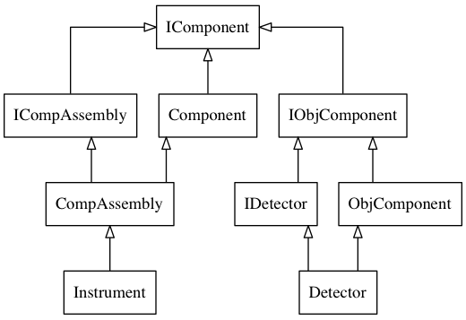

Suggestions and Requirements for Future Features
================================================

##Motivation##

The current instrument geometry matched the requirements in the early programme lifecycle. We have subseqently retro-fitted the geometry as more instruments and more facilities joined the project. This has worked well, but we have several major issues to solve for which a deeper and thourough rexeamination of the existing implementation is required. Firstly, experimental setup is becoming increasingly complex, and we need a virutal instrument that can model the real experimental setup. Secondly, the performance demands are now much greater than orignally designed for, particularly with the live-reduction challenge forethcoming at the ESS. Thirdly, the current syntax for describing instruments is not as logical or straight forward as it ought to be, and encourages instrument related errors in the reduced data.

##High-level Functional Requirements##

###Mandatory###

* Existing functionality listed [here](https://github.com/mantidproject/documents/blob/Instrument-Geometry/Design/Instrument-2.0/features-v1.md) should be preserved.
* The design should allow fast access to L1, L2 via a Detector. Ideally without any lazy computation.
* The design should simplify the process of directing and configuraton from the current experiment (Instrument control).
* The design should allow for complex beam paths, where components may order themselves to create the l1 & l2.
* The design should allow for indirect secondary (i.e. after sample) beam paths, where the detectors and components may have different positions in real and 'neutronic' space.
* Any new schema should allow for thorough validation to detect any logical errrors, for example, avoiding component collision
* Instrument parameter syntax should be richer, particularly when labelling and applying multiple functions to components.
* Any new schema should be more cohesive and self-describing than the current system
* The design should be optimized for reads, not for writes, since the former is much more frequent. See non-functional requirements.
* The design should allows for Moving instruments. This includes instruments that move between acquisition scan points and continuous motion during acquisition. For this it might be useful to separate things into two different concepts: (1) positions/rotations of spectra/event-list (2) detectors with no position/rotation information.
* The design should allow for **tagging** of components with an extendable list of attributes. This would include the existing detector, monitor, sample. This would avoid these tags having to be applied at the instrument level.
* Instruments should have better concept of allowed translations. A work around to this has been found in ISIS SANS.
* Algebra for positions based on log values should be supported. For example setting the source height based on the incident theta log value. Currently this cannot be done without using hard-coded displacements.
* The current functionality lacks a way to coordinate serialization of Geometry Components. This is because the IDF format lacks a proper hierachical structure. Data Transfer Objects should have the responsiblity of serializing an in-memory gemeotry to either a binary or new xml based format.
* The detectors at ESS will have non-negligible depth that might require more complex geometry calculations.
* Voxel detectors will spread out the events that would normally be registered in a single pixel to several voxels, potentially yielding an additional factor.

##Desired##
* The design should make it easy for laser scans to be imported. Components may be marked with 0-n referecnce markers.
* In file formats, definitions should be a first-class citizen, not just a textual representation.
* As far as possible geometry should be shared with instrument control, particularly in terms of instrument definitions.
* It should be possible to port v1 definitions to v2.

###Moving Instruments Requirements###
Unique use cases are:

1. A step scan. 
1. A continous scan.
1. Tripple axis. Data read as S(**Q**, E), so no need for the instrument.

**Step Scans**
A variant on 1. Might be whether each scan results in a unique run [D2b](https://github.com/mantidproject/documents/blob/master/Design/HandlingMovingInstruments.md#use-case-6-ill-d2b-d4-and-d7-instruments), or whether the runs need to be merged later as each scan appears as a separte runs as suggested by [Marina Ganeva] (https://github.com/mantidproject/documents/blob/master/Design/HandlingMovingInstruments.md#other-comments-provided-to-this-proposal).

**Continous Scans**
Truely continous scans can only be done in event-mode, and if where possible to specify component positions and rotation as a function of time. It would then be necessary to correlate absolute event times to the position of the detector at that time in order to establish l1,l2. Currently the IDF only takes a single position entry from a given log, even if it does actually contain many time series entries.

##Performance Non-functional Requirements and Technical Specifications##

### MPI

Especially for ESS, Mantid will most certainly need to be run on a cluster based on MPI.
Currently, one promising model is distributing work by splitting the instrument and assigning a subset of the detectors to each MPI rank.
We can either keep the complete instrument on each rank and only assign the relevant events/spectra, or actually keep only a part of the instrument.

* Keeping the full instrument might lead to memory problems, given that ESS has instruments with up to 10 million voxels.
* If we keep only parts of the instrument, the design of the instrument/geometry code should put no restrictions on how the subsets are defined (various subset definitions might be necessary for different instruments). For example, it must be necessary to split up something like a `RectangularDetector`.
* Splitting does not necessarily need to be compatible with visualization: Splitting is relevant for an MPI run of Mantid on a cluster, where we cannot have a GUI anyways.
* The option to redistribute an instrument might be an advantage. Basically this wold require an instrument design that allows for adding and removing/transferring components without breaking existing workspaces.

### Performance as a (Non-functional Requirement)

It is hard to put down a precise performance requirement.
We can try to do a worst-case analysis, based on various guessing:

* In the current SANS reduction run we observed up to 30% time spent in instrument/geometry related code.
* We hope to do some optimization work on various other parts of Mantid, so we should take into account that the non-geometry related parts will speed up.
* For certain large IDFs the speed of reading the file can become significant.  It would be worth investigation into the use of a binary on disk format for storing the IDF.

Depending on the precise circumstances that may change very little, or could easily imply >80% time in instrument/geometry related code.
In the latter case we would ideally like to have at least a factor of 10 speedup.

* At a later point it might turn out useful if we managed to keep the underlying data layout flexible: In case we need to do some very expensive geometry calculations we might want to resort to vectorization (SIMD), which often works best with an SOA (structure-of-arrays) data layout instead of a AOS (array-of-structures) data layout. This flexibility is not a strong requirement at this point, just a nice-to-have.

### Threading

The current design implements a series of mechanisms to make modification of an instrument thread-safe.
I (Simon) cannot think of a use-case where this actually makes sense: Modifying an instrument while another thread is reading does always seem to lead to race conditions at the macro level, even if things on the micro level are thread safe (I may be overlooking something, please correct me if you can think of a realistic and useful counter example).
Thus:

* Instrument/geometry should be thread-safe for reading.
* Modifying an instrument does not need to be thread-safe.

Basically, I currently think that the requirements here should be the same as for the containers in std (C++11), such as std::vector.

##Current Structure##

###Responsibilities in Current Structure###

**ParameterMap**: MulitMap keyed by ComponentID, which is keyed by just the in-memory pointer to that IComponent, and stores values which are Geometry::Parameter

**IComponent**: Something that can be positioned an manipulated in a 3D coordinate system.  With parent IComponents, it can form a 1-D linked list. Despite suggesting it might be Mutable, public functions indicate that it is NOT.

**Component**: A realization of IComponent, that adds methods to allow immutability. Holds a ParameterMap. If the ParameterMap is set, then keyed values are checked to exist in the ParameterMap first. That way components can be copied by using the Map to 'override' base Component properties.

**ObjComponent**: Adds physical attributes such as shape and material to a Component. 

**ICompAssembly**: Defines a Component that is an Assembly of others. This is a composite. 

**CompAssembly**: Realizes the IComponentAssembly. Adds functionality to make the IComponentAssembly mutable.

###More on how Parameterised Instruments Work###

The ParameterMap is a MultiMap. More than one paramer can be stored against the same ComponentID (key field). The Top-level Component (Instrument) holds the actual parameter map for the entire assembly. All other components hold a pointer to that parameter map. When a component is modified, a 'Parameterized' copy of the Component is made, which contains a back reference to the orignal base, component, and has entries in the parameter map for anything overriden. Because Components have to support Parameterized versions of themselves, two constructors are provided for concrete Parameterized Components. Most of the time you work with Instruments in Mantid, you are operating on a Parameterized version. `ExperimentInfo::getInstrument()` creates a parameterized instrument.

###More on how Component::getPos() Works

* In the absence of a parent object `m_parent`, or a base object `m_base` The position in absolute and corresponds to the stored V3D for that component.
* For Anything that is not the root of the tree, `m_parent` always exists and Component positions are defined relative to that.
* For a Parameterized Component, the map must be searched to extract a potential overriden value first, which is again a relative position.
* Since to determine the actual position of a component, you need to walk the entire component tree, to accumulate relative offsets, `getPos()` uses a cache which stores the absolute position of the immediate parent component, so that the entire tree does not need to be traversed each time a position is required (m_map->getCachedLocation()).
* The map does still need to be searched each time via `this->getRelativePosition()` and this may be an expensive lookup.

