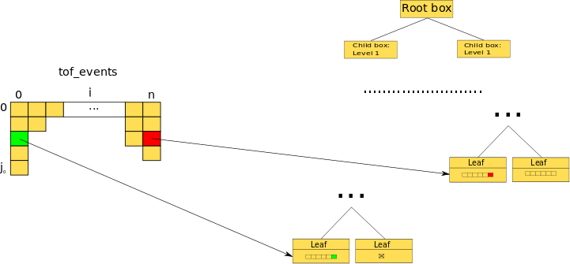
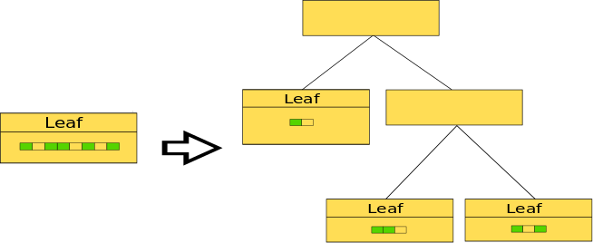
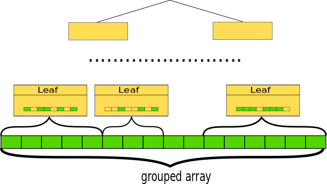
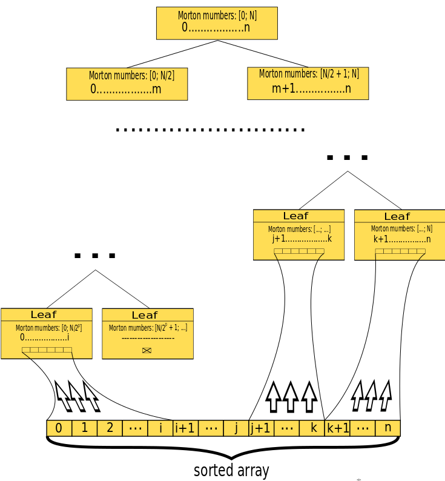
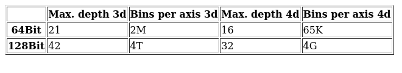
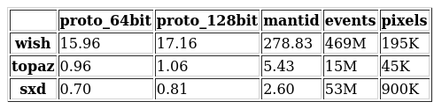
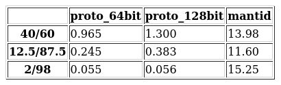
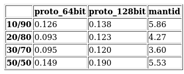

# Multidimentional workspace design

## Rationale

The idea to change the design of MD workspace grows from the slow execution of ConvertToMD algorithm and MergeMD, 
that are used in various work flows. The reason of this is the way of appending events to the workspace. The two main 
use cases for appending events to the workspace are: constructing the MD workspace from the existing event workspace, 
appending the number of events to existing MD workspace (merging two workspaces). Both of this cases require "bulk"
processing of multiple events. 

In current implementation we have this code to treat all cases of appending events:

``` c++
for (size_t i = 0; i < dataSize; i++) { pWs->addEvent(DataObjects::MDEvent<nd>(
     *(sigErr + 2 * i), *(sigErr + 2 * i + 1), *(runIndex + i),
     *(detId + i), (Coord + i * nd)));
}
```

```c++
TMDE(size_t MDBox)::addEvent(const MDE &Evnt) {
  std::lock_guard<std::mutex> _lock(this->m_dataMutex);
  this->data.push_back(Evnt);
  return 1;
```
Common scheme of appending events to the workspace is following:

First step (single thread): 
``` 
FOR i IN [0; n]
    FOR j IN [0; tof_events[i]]
        CONVERT_AND_ADD_TO_WORCSPACE_NODE(tof_event[i][j])
    END
END
```



Second step (multiple threads):

```
    DISTRIBUTE_EVENTS_IN_TREE 
```



The main issue is that the first step can't be effectively parallelized, because we need a random access to the leafs of 
the workspace tree. Even if we provide the thread safety through mutex (to avoid adding multiple events to the same node
with different threads at the same time) for every leaf, locks are very inefficient. 

## Proposed implementation

The common idea is to split step 1 into two: conversion the time of flight event to MD event and appending to the 
workspace. Then the conversion step can be obviously parallelized, But we still have an issue with appending events.
The natural approach to solve this issue is some kind of ordering or groupping events to have the ability to append
different groups in non blocking manner with multiple threads. 



For creating MD workspace from scratch we actually need sorting instead of grouping, because we have no leafs and do
not know how to group events for each leaf.
For optimization of memory utilizing and cache usage the best way is to have the continuous (in terms of memory) chunks 
with events corresponding to particular box, which are not fragmented during the splitting the box (MD events should 
keep order when box is split). That means we have 
to introduce some mapping from Z<sup>n</sup>+ (n-dimensional positive integers, box space) with hierarchical dynamic
structure (nested boxes) to Z+ (1-dimensional positive integers, memory space).
 
The known way for providing such mapping is using space filling curves: the discrete coordinate of the
box on this curve become the additional 1d index for any MD event and every box contains the continuous range of this 
indexes. Then we can sort the events using index and get the continuous chunks of memory, corresponding to every box. 
The most simple space filling curve is Z-curve or Morton curve and the 1d space index is called Morton number in this
case. Due to the simplicity the Morton number can be computed very fast. 

*2D Z-curve picture from wikipedia:*


*Using this additional indexing the workspace creation could be like on this scheme:*





*And adding new portion of events:*  


### Utilizing the index
The Morton numbers of different length provide the different discretization limits for the workspace, for example  using
64bit Morton number for Nd space you can split the initial box into 2<sup>(64//N)*N</sup> smallest boxes, that
corresponds the tree with the split factor 2 for each dimension of depth 64//N. The table below contains the maximal
tree depth and number of bins per dimension in different cases.



It seems that 128bit Morton numbers cover all possible use cases, in many scenarios 64bit would be sufficient. The
setting to choose Morton number length could be provided.  Of course it always better to have more precision than less,
but the length of 
the Morton number affects the size of the structure that stores MD event (MDEvent) information that is the critical 
parameter for processing performance (the dependence is linear) because of frequent copying with the respect to cache 
efficiency, and also the time to calculate the longer number is bigger. To decrease the size of the MDEvent it is 
possible to throw the Nd coordinates from the MDEvent, they can be retrieved from the morton number with the accuracy 
bounded by the discretization limit described above. The size of the 3d lean event (MDLeanEvent<3>) with the 32bit 
floating point coordinates is 20 (8 + 12 for coordinates) bytes, if we substitute this coordinates with 64bit Morton 
number it is 16 bytes, 128bit Morton number - 24bytes; for 4d: 24bytes for both coordinates and 128bit Morton, 16 - 64 
bit Morton. The options are:

#### 1. Keep both floating point coordinates and Morton number.
In this case we would save all interfaces, formats and so on, but this is not so good for performance of proposed
algorithms for merging and appending events, because of bigger size of MDEvent. Also with approach leads to significant
memory overhead, that makes it less attractive. This is the simplest case for reimplementation in current version.

#### 2. Keep only coordinates.
Follow this approach we need to compute morton number every time during the appending procedure (sorting and merging), 
that could be too much expensive, especially for sorting, also we need to provide access to the top level bounding box 
from every single event to compute the Morton number. This option is rather simple for implementation but less 
promising in the performance field, sorting is ~10 times slower in this case for the same length of the Morton number.

#### 3. Keep only the morton number.
We can lose accuracy comparing with floating point coordinates in some cases, but can choose longer Morton number to be 
more precise. We need to compute coordinates every time, so access the top level bounding box from every single event.
That means that we need to push some reference to bounding box through all  calls in chain to the getCoordinates(). 
And also we need to reimplement all functions that change the floating point coordinates (workspace transformations) to 
transform only the top level bounding box. This option is the most labor-consuming, my optimistic estimate would be 3-4 
months.         

#### 4. Switch between the Morton number and floating point coordinates.
Here we can store either Morton number or coordinates in the same memory and switch between them. As in 3 we can lose
accuracy some time (if use 64bit Morton number in 3d space) or have small memory overhead in MDEvent (if use 128bit 
Morton number in 3d space). In principle if we are very concerned about memory we can use "96bit" Morton number.
The switching operation should be applied only internally in functions that operate appending events, like following:
``` c++
void MDWorkSpace::appendEvents(EventType events) {
    restoreMortonIndex();
// Append events here
    restoreCoordinates();
}
```
This additional steps for restoring coordinates takes less than 15% of sorting time only. In this approach we should
change only the algorithms, which are related to the changing of the tree structure, concretely: appending new events
and build the workspace, this are only a few functions. All other functionality would not be involved. Also
we can even leave a possibility to use the old version of structure without any changes and algorithms and add indexing
as an option: we should use an index not longer than coordinates storage in this case.

### Access to the global box.
We can consider the one global box (hardcoded or global variable) big enough for any instrument or coordinates in any
workspace, in this case we should use te 128bit Morton numbers and would not lose the accuracy.     

## External storage formats
The proposed implementation will not affect any external storage formats, because in any case we would have the 
floating point coordinates to store.   

## Drawbacks
1. The split factor parameter (SplitInfo) can me only be chosen from the powers of 2 (e.g. 2, 4, 8, 16...) and should be
 the same for each dimension.
2. Fixed global box. Changing the global box boundaries is equivalent to constructing all the structure from scratch, so
it is very expensive to expand global box during the appending events.

## Some benchmarks results

Below there are some results of benchmarking for workspace creation and merging for prototypes with different Morton
numbers in comparison with current mantid implementation.

### Workspace creation

Here are the results of workspace creation benchmarks for different files of different instruments, time in seconds:



### Merging workspaces

For this benchmarks the existing files have been split into 2 chunks with some filtering provided by MantidPlot. The
first column in the table is the relation between chunks in percentage of the initial file. Other columns contain
time in seconds.

*Some SXD file, number of events ~= 53M, number of pixels ~= 45K*



*Some TOPAZ file, number of events ~= 15M, number of pixels ~= 900K*

