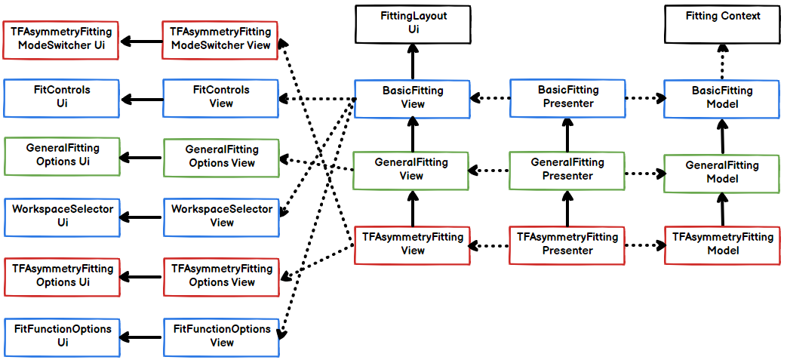

# Muon Fitting Widgets Design & Implementation

## Introduction

This document outlines the design and implementation of the fitting widgets used within the 
Muon Analysis and Frequency Domain Analysis GUIs. These widgets have been created with the 
aim that they are reusable across many parts of the Muon fitting framework. 

## The Different Fitting Widgets

There are currently three different fitting widgets used in Muon fitting, each written in an 
MVP style:

 1. The **Basic Fitting Widget** is the most basic of the fitting widgets. It allows you to 
    perform a fit, undo a fit, plot a guess, and open the Fit Script Generator. The fit 
    can be a single or double pulse fit. It also provides the ability to choose fit functions 
    and other fit options.
	
 2. The **General Fitting Widget** has all the capabilities of the **Basic Fitting Widget**, 
    plus it allows you to perform simultaneous fits over specific Runs and Group/Pairs. It 
    also allows you to cycle through the different datasets which are loaded into the fitting 
    widget.

 3. The **TF Asymmetry Fitting Widget** has all the capabilities of the **General Fitting Widget**, 
    plus it has a TF Asymmetry fitting mode where you can enter a normalisation parameter and 
    perform a TF Asymmetry fit.

## Where is each widget used?

This section describes where the widgets are used, and how they are each separated into 
sub-widgets. This separation allows the order of the sub-widgets to be changed so that all 
the widgets comprising the **Basic Fitting Widget** (for example) do not have to be next to 
each other. Instead, each sub-widget is added to specific area within a vertical layout as 
illustrated by this image.

  

## Basic Fitting Widget

The **Basic Fitting Widget** is not used on its own in any of the Muon interfaces, instead 
it acts as an initial ‘building block’ for the other fitting widgets. It consists of two 
separate widgets, the *Fit Controls* widget, and the *Fit Function Options* widget.

  

The following diagram details the file organisation for the **Basic Fitting Widget**. The 
*Fit Controls* widget and *Fit Function Options* widget is added to the fitting layout within 
the constructor of the Basic Fitting View. The dotted arrow means ‘has a’ and the full arrow 
means ‘is a’ (i.e. inherits from).

  

## General Fitting Widget

The **General Fitting Widget** is used on the fitting tab of Frequency Domain Analysis. It 
inherits the widgets found in the **Basic Fitting Widget**, and it also has a *General Fitting 
Options* widget which allows you to perform simultaneous fits over specific Runs and Group/Pairs.

  

The following diagram details the file organisation for the **General Fitting Widget**. The 
*General Fitting Options* widget is added to the fitting layout within the constructor of the 
General Fitting View. The dotted arrow means ‘has a’ and the full arrow means ‘is a’ 
(i.e. inherits from).

  

## TF Asymmetry Fitting Widget

The **TF Asymmetry Fitting Widget** is used on the fitting tab of Muon Analysis. It inherits 
the widgets found in the **General Fitting Widget**, and it also has a *TFA Asymmetry Mode 
Switcher* widget and a *TF Asymmetry Fitting Options* widget which allows you to perform a 
TF Asymmetry fit with a normalisation.

  

The following diagram details the file organisation for the **TF Asymmetry Fitting Widget**. 
The *TF Asymmetry Fitting Options* widget is added to the fitting layout within the constructor 
of the TF Asymmetry Fitting View. The dotted arrow means ‘has a’ and the full arrow means ‘is a’ 
(i.e. inherits from).

  

## Notes

If any further changes are made to the design or organisation of these widgets then this design 
doc should be updated.
