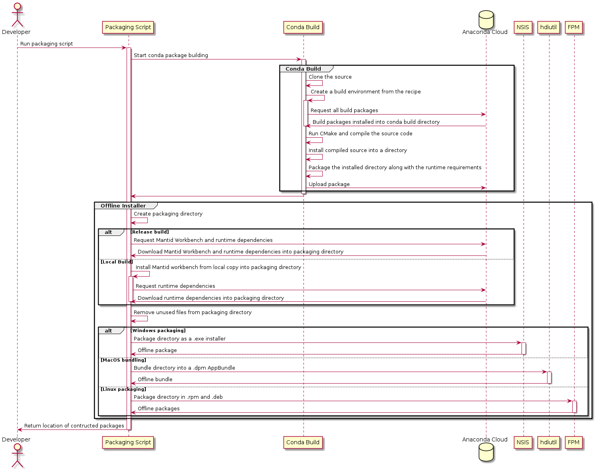

<!-- This document's diagrams are produced using the .plantuml documents in this file's directory and plantuml -->
# Future packaging with conda
## Current methodology
At present we have bespoke methodologies for packaging on each different OS we support (Windows, MacOSX, Ubuntu, and CentOS/RHEL7).

- On Windows, we create a packaged installer containing our dependencies and our compiled program as a .exe. We only link to some parts of System32 that provide Windows functionality required for Mantid, and the OpenGL shim to handle the graphics drivers. We install Mantid running the .exe installer by double clicking on the executable.

- On MacOSX, we create a package containing our dependencies and our compiled program in a .dmg app bundle. Only low level packages that are expected to exist on MacOSX. We install Mantid .dmg by running the installer by double clicking on the bundle.

- On Ubuntu, we create a package containing only our compiled program in a .deb format. We rely on the the currently available system packages to run Mantid. We install the Mantid .deb package using dpkg.

- On CentOS/RHEL7, we create a package containing only our compiled program in a .rpm format. We rely on the currently available system packages, optional packages from `rhel-7-workstation-optional-rpms` and some packages from EPEL to run Mantid. We install the Mantid .rpm package using the rpm command.

## Intended move forward

All operating systems should have a fully built and deployable conda-build implementation, where a use can in theory run a simple command in conda and it will install Mantid with all it's runtime dependencies, which with some small tweaks we can then package on all Operating Systems assuming that the conda-build recipe has been created and ran successfully.

The aim at this time is to create similar packages to what we have now on MacOSX and Windows, whilst shipping all dependencies in our Ubuntu and CentOS/RHEL7 which is a change. We will make a .exe for Windows, .dmg for MacOSX, .deb for Ubuntu, and a .rpm for CentOS/RHEL7 much like we do now on all operating systems.

In order to provide 2 lines of packages, a stable release, and a nightly release, using 2 labels for each package stable labelled as `main` and nightly builds labelled as `nightly`. A user will be able to get either via conda build and as an offline package on our website. We have an option of producing limited unstable/developer builds should the scenario for testing or prototyping with users, the Anaconda cloud could be a good method to distribute these with a `dev` label.

### Conda build

We intend to distribute a conda package using the conda-build system, which will allow advanced users to install Mantid using conda. Users will be able to install this packaged version with, 
```bash
conda install -c mantid mantid-workbench
```
The user will then be able to interact with the package in a manner familiar to any users of other conda packages, e.g. Spyder, Numpy,
```bash
conda install -c mantid mantid-workbench // Install conda package
python -c "import mantid"  // Import mantid
MantidWorkbench // Launch workbench
```
The runtime requirement specified by the conda build package will be used to produce our offline installers, as described below. 

### Producing Offline (None-Conda) packages

On all operating systems we will need to create the directory from which the package will be made, the command to do this will look something like this:
```bash
conda create -p package_dir mantid-workbench --copy -c mantid -c conda-forge -y
```

In the case of a package that was not uploaded to the Anaconda Cloud like the previous command expects, you can do this from a locally constructed package and achieve the same result using this command:
```bash
conda create -p package_dir --use-local mantid-workbench --copy -c conda-forge -y
```

For Linux operating systems I suggest using FPM (Effin Package Management - https://github.com/jordansissel/fpm) due to it's simplicity and ease of creating .deb and .rpm installers, from one machine, therefore in the future it should be possible to create all Linux distribution packages from one machine. At present it is not planned to use FPM for MacOSX as it doesn't support .dmg app bundles, and the support it does provide for .pkg files on MacOSX is less than ideal for the same reasons we already migrated away from .pkg files in the first place.

For MacOSX, we need to make .dmg files, we can use a very similar strategy to linux here but with hdiutil (Disk Utility built into MacOS used similarly to how FreeCAD has: https://github.com/FreeCAD/FreeCAD-Bundle/blob/master/conda/osx/create_bundle.sh)

For Windows, we intend to continue using NSIS to produce a .exe installer. We evaluated WIX unfortunately the amount of time it would take to not only switch but to learn how to switch from NSIS is not worth the benefits, this isn't out of the question long term. 


## An overall look at the process
Everything will be achieved from a single script that can be worked into CMake or some other method of calling. The packaging script should return either a locally built Conda-build that is then uploaded or not uploaded, depending on this upload status we then create the environment by either downloading the dependencies and mantid workbench, or just the dependencies using a local mantid workbench constructed with Conda-build. I have produced a Sequence Diagram to better explain the suggested process:


## Alternatives

The various Linux distributions have their built in .deb and .rpm creation tools, as well as the abstraction layer that comes from CPack enabling building and linking to system packages. We do not want to link to the system packages, whilst conda-build will get all the required packages for us whilst CPack is not capable of this.

MacOSX currently uses CPack, it has a custom ruby script and would likely work for our current purposes, however it is frustrating to maintain, we would be able to unite the script for package creation for MacOSX and POSIX systems and a lot of the details should allow for easier packaging scripts. 

Windows at present uses CPack and NSIS to create the packaging. With CPack being rolled back, we intend to stick with NSIS via the larger packaging script. At present we just put in the required dependency .dll by installing them into the bin of the package, Conda will handle this for us.

## Looking to the future
Considering Mantid Workbench is large and all-encompassing, it may be prudent to look at potential future project deliverables that don't include all parts of workbench that are included now.

Into the future, it would be possible to support many different packages of differing levels of support. It would be possible to have different levels of workbench specialisation utilising conda-build packages that incorporate different dependencies. For example, in the future different groups at ISIS would like to include python libraries that would only be useful for their respective fields and not to the project as a whole.

In order to support multiple versions of Mantid a greater level of granularity will need to be achieved in the code base. The ability to actively seperate interfaces, algorithms, etc are all things that are possible given this proposed conda packaging implementation, given some tweaking and development time.
