# Design Document for ISIS SANS Backend Rewrite

This document defines the design  for a new ISIS SANS back-end as required by
MantidProject issue [#15875](https://github.com/mantidproject/mantid/issues/15875).

The intention of the issue is to replace the organically grown and now difficult to
maintain back-end of the ISIS SANS reduction work-flow.

### Definition of terms

| Term  | Definition|
|------|------------|
|ADS   | Analysis Data Service|
| PI   | Python Interface |

## Motivation

The current SANS reduction system makes use of the so-called `ReductionSingleton`,
which essentially stores the configurational state either directly, in `ReductionStep`s
or in an `ISISInstrument` object. The `ReductionStep`s are deeply coupled to the
`ReductionSingleton`, which makes it hard to unit test them
(and probably explains why such tests do not exist).
In addition there is a strong coupling of this `ReductionSingleton` to the
GUI logic, which essentially renders the ISIS SANS reduction a monolithic block.

A more modern approach is to use Mantid's `WorkflowAlgorithm`s. A sequence of
algorithms performs the the reduction, where each algorithm gets the information
required for the reduction at the time it executes. The `WorkflowAlgorithm` is
used as a unit of clearly defined work and **not** as a container for
state information. This mechanism avoids the deep coupling as the each algorithm is
agnostic about its calling environment and information flow is into the algorithms
(except for resulting output workspaces).
This creates an ideal environment for unit testing and improved documentation.

## Reducer 2.0

As per requirement [R.2.4](User_Requirements.md#R.2.4) the reduction of a single
run should be the limit case of the reduction of a batch file. Currently the
implementations are slightly different. Unifying the two approaches will increase
 maintainability considerably

### SANS State

The current ISIS SANS system suffers from a state which is distributed and stored in many different places. The state for a the SANS reduction system should be localized and complete, i.e. it defines the entire reduction.

A design document for a `SANSState` approach is available
[here](SANSState/SANSState.md).

The `SANSState` contains a complete set of information to define a single reduction.

### Batch reduction

Starting point of a reduction is a collection of `SANSState`s which define one
 reduction per `SANSState`. This batch reduction is handled by a work-flow
 algorithm `SANSBatchReduction`. It should be able to operate the individual
 reductions in parallel (does this mean, we need to implement it in `C++`?),
 which is in line with requirement [R.3.2](#User_Requirements#R.3.2).

The `SANSBatchReduction` performs two tasks:
1. Loads files into the ADS if they are not present yet. These workspaces remain
in mint condition, i.e. we don't want to move them in order to be able to reuse
 them. The calibration workspace is being loaded into the ADS as well.
2. Passes the loaded workspaces and the `SANSState` to a work-flow algorithm,
which performs a single reduction.

The above ADS feature might be considered unclean, since an work-flow algorithm
 is accessing the ADS, but this allows us to reuse loaded workspaces which has
 been expressed as requirement [R.3.1](#User_Requirements#R.3.1). We could think
 of using the ADS as an optional element.

**Open Question**: What should be done with the output workspaces after each reduction:
  1. Save each workspace to file after each individual reduction
  2. Add each workspace to ADS after each individual reduction
  3. Collect the output workspaces and save them all at once.
  4. Leave this as an option for the user

#### Implementation of `SANSBatchReduction`

The activity diagram  below displays the expected work-flow of the  `SANSBatchReduction`. It loads the required workspace and passes it on to the `SansSingleReduction`. It is also responsible for splitting up a `SANSState` object if it was responsible for performing several reductions due to underlying period files.

### Single reduction

A work-flow algorithm `SANSSingleReduction` is responsible for the actual
reduction. Input properties would be:
1. a complete `SANSState` (required)
2. a sample scatter workspace (required).
2. a sample scatter monitor workspace (required)
3. a sample transmission workspace (optional), but required if sample direct
workspace has be provided.
4. a sample direct workspace (optional) , but required if sample transmission
workspace has been provided.
5. a can scatter workspace (optional)
6. a can transmission workspace (optional), but required if can direct
workspace has be provided.
7. a can direct workspace (optional) , but required if can transmission
 workspace has been provided.
8. reduced can workspace (optional)

The reduction itself is determined by the `SANSStateReduction`, which would
 contain configurational information which is important for `SANSSingleReduction`.
 This could be e.g. LAB, HAB, BOTH, MERGED. The reduction will have to run a
 core reduction sequence of steps for each period of the sample workspace.

The work-flow is depicted below:

 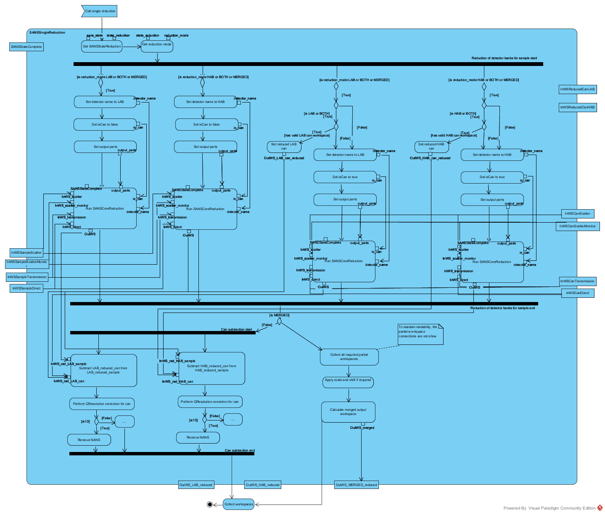

#### Core Reduction

The core of the reduction is very similar to the reduction which is currently being performed. The individual tasks are split up into "simple" algorithmic tasks.

The reduction core performs the following tasks:

1. Creates an adequate copy of the workspace via a `CropWorkspaceToDetector` algorithm (which needs to be written).
1. If the workspace is an event workspace and an event slice was specified then this is applied. The `SANSStateSliceEvent` is passed to `SANSSliceEvent`.
1. Move the instrument to the correct position. Note that we do this on the copied workspace which is to be reduced (not on the original workspace). The information required is passed to `SANSMoveWorkspace` via `SANSStateMoveWorkspace`.
1. Applies masking to the sample workspace. This passes the sample workspace
 along with the `SANSStateMask` object to `SANSMask`.
2. Convert the TOF data into wavelength-based data. This passes the sample
workspace along with the `SANSStateConvertToWavelength` object  to `SANSConvertToWavelength`.
3. Multiply the volume and the absolute scale to the workspace. This passes
the sample workspace along with `SANSStateMultiplyVolumeAndAbosoluteScale`
to `SANSMultiplyVolumeAndAbosoluteScale`.
4. Create adjustment workspaces which are required for the final q-conversion
stage. This includes normalization to a monitor,  transmission calculation
and wide-angle correction as well as handling information which is loaded from
flood and calibration files. This step passes the sample workspace along with
the `SANSStateCreateAdjustmentWorkspaces` to `SANSCreateAdjustmentWorkspace`.
5. Converts potential event-mode data into histogram-based data. This step passes
the sample workspace along with `SANSStateConvertEventToHistogram` to
`SANSConvertEventToHistogram`.
6. Converts from wavelength-based data to q-based data. This step passes the
sample workspace, the adjustment workspaces and `SANSStateConvertToQ` to
 `SANSConvertToQ`.
7. Check if a reduced can workspace was provided.
  1. If it was provided, then the reduction core is done.
  1. Else perform the steps above for the can configuration.
8. Return workspaces, e.g. reduced sample, reduced can , maybe partial
 workspaces (if MERGED has been selected)

The basic workflow for this core can be see below:

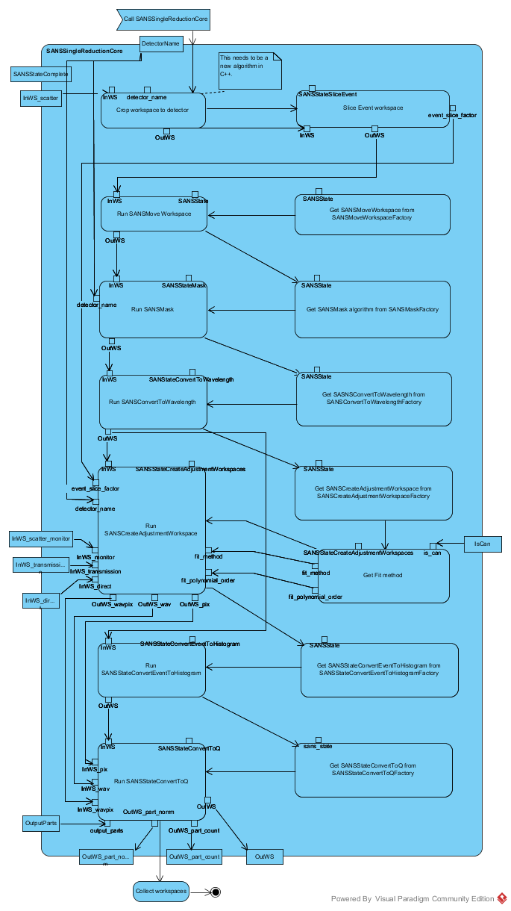

### Selection of instrument specific implementations

The current SANS implementations are instrument-specific and static. It is
important to recognize that some parts of the reduction might well have to
be instrument/facility-specific. In order to keep the reduction chain dynamic,
the implementation of a specific step is created by an adequate factory. Some
ISIS-specific implementations are presented below. These implementations will
also be used as a default setting.

If a facility requires a different calculation technique then, it needs to create
a work-flow algorithm which subscribes to the output signature and register it
with the adequate factory.

### ISIS implementations

The implementation of the work-flow algorithms for ISIS SANS are discussed below. Note that in the activity diagrams below the absence of a connection of an input pin, means that it is connected to the `SANSState` input.

#### `SANSMaskISIS`

The masking for for ISIS instruments is fairly complex. Masking is applied for:
1. General bin masking
2. Bank-specific bin binning
3. Detector masking for beam stop
4. Detector masking for a list of masking files
5. Detector masking for a list of spectrum numbers
6. Detector masking for an angle-slice
7. Detector masking for beam stop arm

The inputs for this algorithm are a sample/can workspace, the name of the current
detector being investigated (for bank-specific time binning) and the
`SANSStateMask` object.

The functionality and its dependence on specific parameters is depicted below.

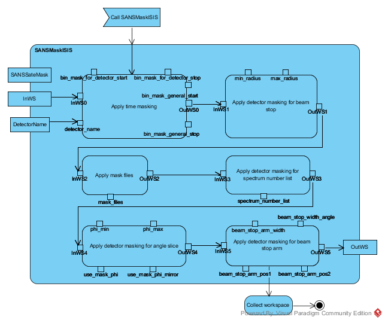

#### `SANSConvertToWavelengthISIS`

This performs a conversion from a TOF-based workspace to a wavelength-based
workspace. In this processes it also performs a rebin.

The functionality and its dependence on specific parameters is depicted below.

#### `SANSMultiplyVolumeAndAbosoluteScaleISIS`

This calculates the volume based on geometry information and multiplies this
along with an absolute scale to the workspace.

The functionality and its dependence on specific parameters is depicted below.

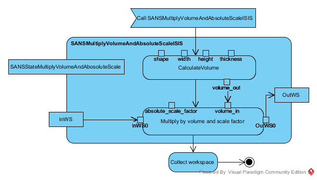

#### `SANSCreateAdjustmentWorkspacesISIS`

This is a rather complex algorithm which contains some sub-work-flow algorithms. The inputs are:

1. `SANSStateCreateAdjustmentWorkspaces` (required)
2. sample/can workspace (required)
3. sample/can workspace monitor (required)
3. detector name (detector specific adjustments are being performed)
4. transmission workspace (optional)
5. direct workspace (optional)
6. scaling factor normalization (optional)  (is for event slicing)

The functionality and its dependence on specific parameters is depicted below.

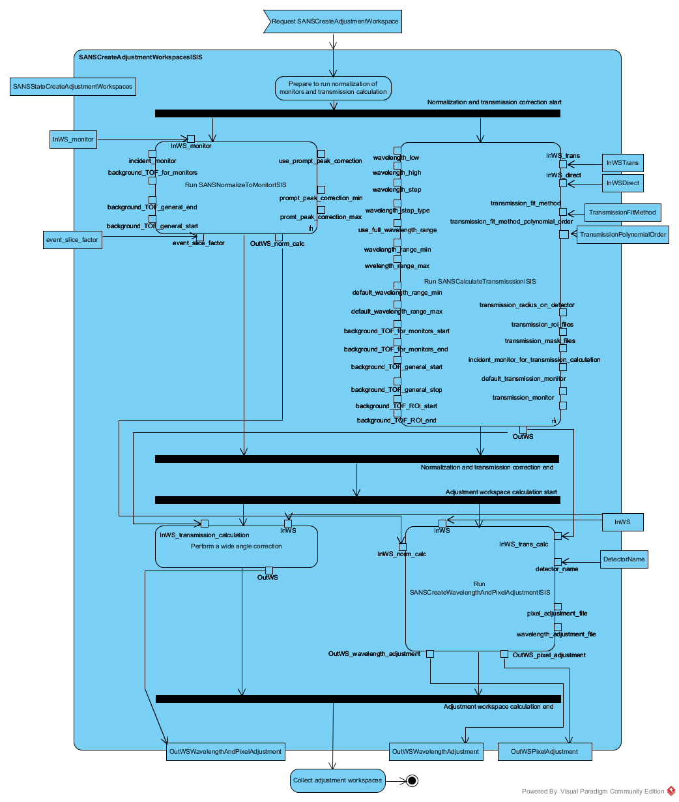

The are several parts to this which are split up into separate work-flow algorithms. In fact the components are very similar to the existing components, but while in the the current setup the different parts of the adjustment workspaces are created at different times and in different locations of the reduction flow, we intend to localize the functionality.

The workflow of the algorithm responsible for creating pixel-dependent and wavelength-dependent adjustments can be seen below:

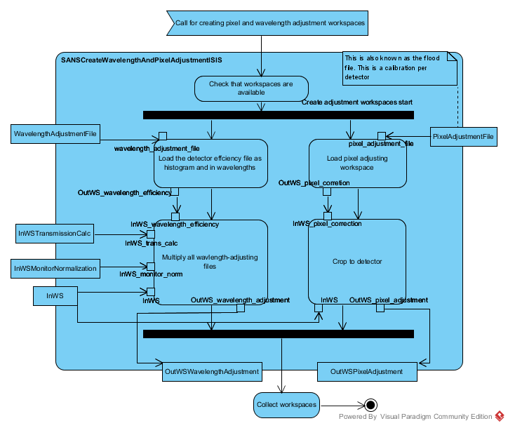

This algorithm relies on an input workspace which contains information about the normalization to monitor and a workspace
which contains information about the transmission calculation which are shown below

####### `SANSCalculateTransmissionISIS`

This calculates the transmission correction.

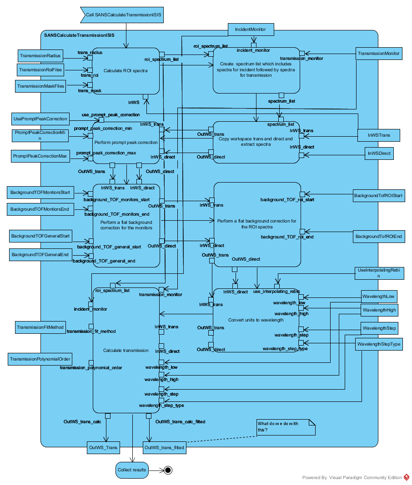

###### `SANSNormalizeToMonitorISIS`

This calculates the contribution of the monitor normalization.

#### `SANSConvertEventToHistogramISIS`

Having avoided a conversion from event-type data to histogram type data, we
have to make this conversion before passing data to `SANSConvertToQISIS`.

The functionality and its dependence on specific parameters is depicted below.

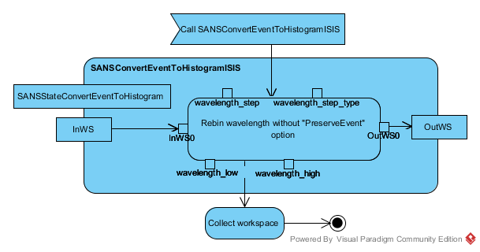

#### `SANSConvertToQISIS`

The inputs for this algorithm are:
1. `SANSStateConvertToQ` (required)
2. sample/can workspace (as histogram) (required)
3. Wavelength-adjustment workspace (optional)
4. Pixel-adjustment workspace (optional)
5. Wavelength-and-pixel-adjustment workspace (optional)
6. Flag if to produce outputs by part

This work-flow algorithm will run mainly call either `Q1D` or `QXY` for the conversion to q-based data.

The functionality and its dependence on specific parameters is depicted below.

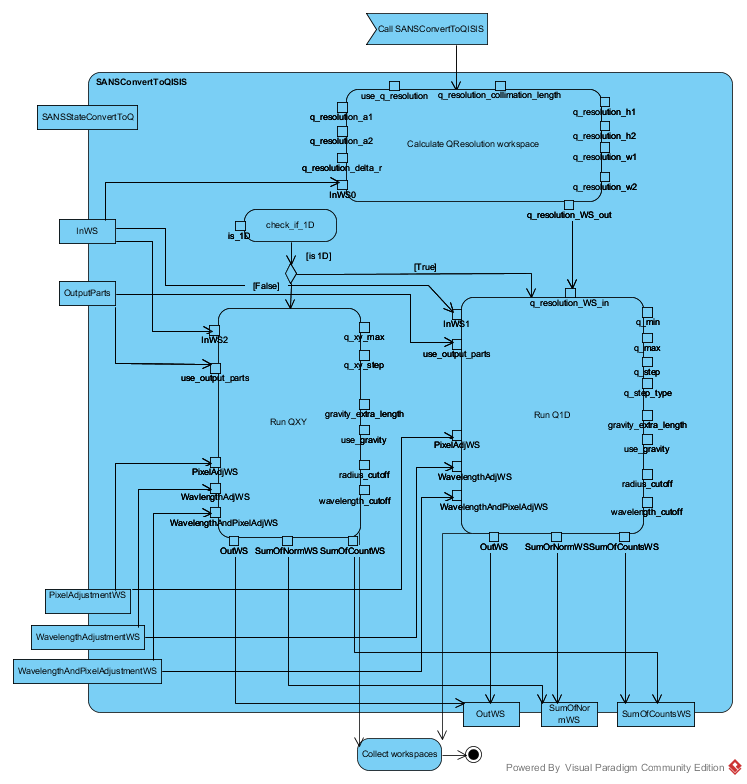

## Workspace loading

The logic for loading workspaces has been a seizable part of the original SANS reduction code base. The main reason for this is the fact that there are many different data input formats such as:
* *.raw* files
* *.nxs* files with histogram-type information
* *.nxs* files with event-type information
* multiperiod data for each of the types above
* added histogram-type data
* added event-type data

which can be used for
* the data workspace
* the data monitor workspace
* the transmission/direct workspace

Unlike many other applications in Mantid, loading has gone traditionally through the ADS. Here, this feature is being kept, since it is desireable to avoid reloading already loaded data (see [R.3.1](#User_Requirements)). This optimization should be applicable to all data.

In order to reuse the data which is being requested by a reduction the new work-flow will look for untouched copies of a workspace (i.e. they should not have been moved). It is impossible to judge if a loaded workspace has been altered by the user. The only thing that can be done, is to reset the workspace to its original position, if move operations have been applied to it.

In the most common case, we should not have to worry about altered workspaces, since the reduction does not touch the workspaces themselves. There will be however an option on the loaders to allow Users to apply a move operation on the workspaces while loading. This is required since we
Users would like to be able to check the detector position on the fly (see [R.3.5.](#User_Requirements)).

A general algorithm `SANSLoadData` will receive a `SANSState` object from which it will decide via `SANSLoaderFactory` which type of `SANSLoader` to  instantiate. This will allow for facility-dependent adjustments should they be required. A `MoveWorkspace` option will allow for moving the workspaces on initial loading should the User explicitly want to do so.

See the details in the image below.

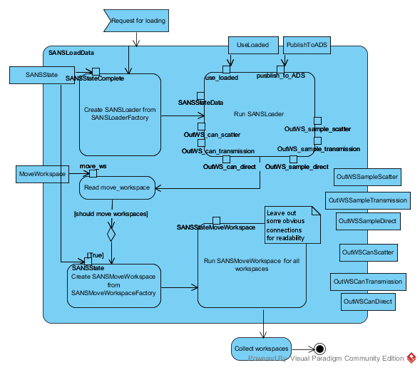

The `SANSLoader` will loop over all defined data workspaces and load them with the appropriate command. Note that we need to distinguish between loading transmissions and loading scatter data. The `SANSLoader` is lastly also responsible for search for a workspace on the ADS and for publishing a workspace to the ADS if this has not been done yet. The two diagrams below show the basic logic flow of the actual loaders

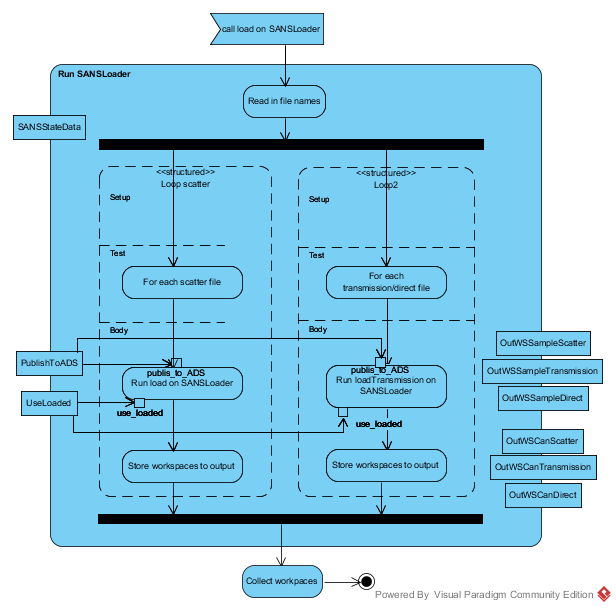

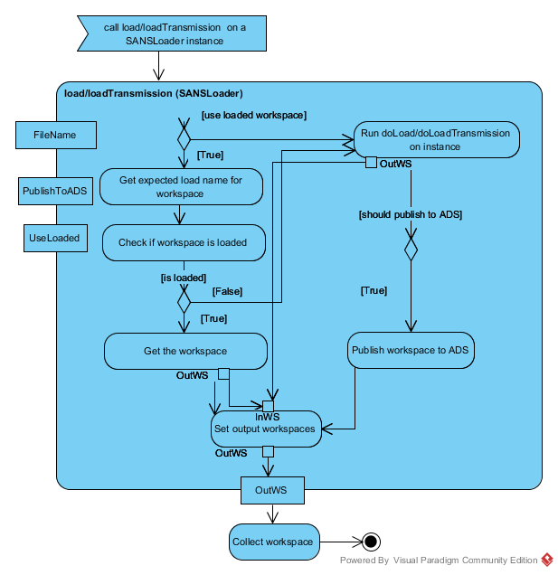

The individual loaders themselves will determine which loading strategy to apply to the file in questio, ie multiperiod, *.raw* etc.

## Interfacing the new reducer system with the Python commands

The users have been used to the PI for a long time now and many scripts have been used using this syntax style. The syntax actually makes use of a global state (the `ReductionSingleton`) which is not fully in line with the new design. It is a clear goal though to ensure backwards-compatibility with the old reduction scripts (see [R.1.2](#User_Requirements)). In order to achieve we need a global-state contain, similar to the `ReductionSingleton`. In general this is not desirable and we do not want this design to be part of the new reduction system in general.

We can keep the old PI syntax and not have any global state logic in the reduction system by providing a specialized `SANSStateDirectorPythonInterface`, which subclasses from `SANSStateDirector` and is a singleton. This is then used by the standard PI commands to setup a state. When the reduction is to be run by calling the PI's `WavRangeReduction` function the standard `SANSBatchReduction` algorithm is run with the `SANSState` which is provided by the `SANSStateDirectorPythonInterface`.
