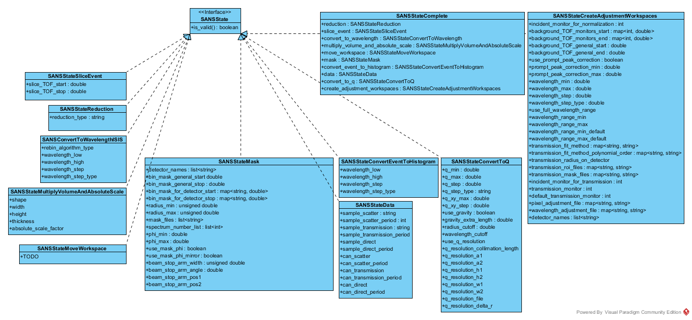
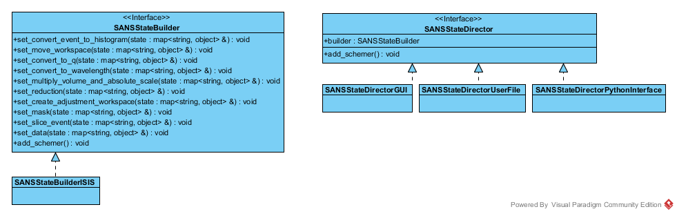

# State Object of the new SANS reduction workflow

The aim of this document is to introduce a new way to store reduction state information for an ISIS SANS reduction.

## Terms

| Term | Defintion|
| ----|-----------|
| GUI | Graphical User Interface|

## Motivation

The motivation for a State object approach of ISIS SANS can be found [here](../Design_Document.md). The [current status](#CurrentStatus) demonstrates the complexity of the current state distribution among the `ReductionSingleton`, the `ReductionStep`s and the `ISISInstrument`. Besides being "all over the place", there is a tight coupling of the reduction's state and the GUI.

## Current status  

### State in the backend

A detailed analysis of how the state is spread in the current implementation can be found here [here](./SANS_mapping_of_backend_variables.md)

#### State in the GUI

A detailed analysis of the GUI and its coupling to the
current reducer back-end can be found [here](./SANS_mapping_of_GUI_variables.md).

## State Object approach

### Arguments for a state approach

Some issues with the current approach are:

1. The current ISIS SANS back-end elements contain interdependencies. Currently, for example, the `TransmissionCalc` obtains wavelength binning information from `UnitsConvert`. This means that if `TransmissionCalc` is to be dynamically replaced (because a new instrument might need a completely different way to do transmission calculation), then this will most certainly break the reduction system.
2. The `ReductionSingleton` owns the `ReductionStep`s, but upon execution of a `ReductionStep`, passes itself into the `execute` method of that step. This means that each `ReductionStep` has explicit knowledge of the `ReductionSingleton` and very often even of the implementation of the `ReductionSingleton`.
3. The GUI reads and writes directly to the back-end elements.
4. Creating a new reduction setup often means that the `ReductionSingleton` needs to be created again. This often resulted in files being loaded again, since it was very hard to figure out what the previous state had been.

Having a clearly localized data structure which contains the complete state required for a reduction will allow us to:

1. Eliminate interdependencies by passing all necessary information via the state object to each unit of work (formerly `ReductionStep`) separately and independently.
2. Eliminate the need of the unit of work to have knowledge about its owner (or caller), since all required information is in the state object
3. Eliminate any coupling to the GUI, as a state is manipulated entirely on the GUI side, and then passed to the reduction system for processing.
4. Allow for easy tracking of state change. Having a localized, simple data structure with the entire state makes the comparison trivial (e.g. hashsums of the data structure)

### State design

The state will have to contain more than 100 configuration variables of which a large fraction are available to the user. The state itself should be (almost) a passive data structure. The only functionality which could be conceivable here is a type of self-consistency check (but the implementation might force us to have this check in place when the object is being created. Alternatively, we a type of schemer object is possible.)

The entire information required for a SANS reduction should be contained in a `SANSStateComplete` object. The configuration of this state should be handled by a `SANSStateBuilder` which in turn is/can be governed by a `SANSStateDirector`.

#### Where will state be generated?

There are several scenarios where a `SANSState` can be generated.

1. It can be generated when a user file is read in. This converts the information on the user file into a state object. Note that this is not a complete state object, since it will be missing important components such as data information. This would require a `SANSStateDirectorUserFile`
2. A GUI side request for a reduction. From the GUI settings a list of `SANSState` objects is created which is passed on to `SANSBatchReduction`. This requires a `SANSStateDirectorGUI`.
3. A user sets information via the PI. Using the current PI forces the a global object onto the design. This can be achieved by defining a `SANSStateDirectorPythonInterface` which is essentially a Singleton object.
4. A `SANSState` is passed into the `SANSBatchReduction` for processing. The algorithm splits the old state up into a `SANSState` per period which is to be processed. This is achieved via a `SANSStateDirectorPeriod`.

### Sub-states
Since a reduction in the SANS work-flow can depend on more than 100 variables it is advisable to not store them in a flat data structure. Hence a  `SANSStateComplete` object should be composed of sub-`SANSState` objects which contain information relevant for a unit of work, e.g. a work-flow algorithm, or a specific domain, e.g. instrument information.

The envisioned sub-states are:

| sub-`SANSState`     |  Information content |
|---------------------|----------------------|
| `SANSStateData`     | Contains the full file paths for the data which is to be reduced. (sample_scatter, sample_transmission, sample_direct, can_scatter, can_transmission, can_direct)|
| `SANStateMoveWorkspace` | Contains general instrument information. Contain a map to the available detector banks and the detector which is currently being investigated.  It has all the required settings to move an instrument of a specified type.|
| `SANSStateMask`  | Contains mask information (detector dependent!)|
| `SANSStateConvertToQ` | Contains information for the q binning conversion
| `SANSStateMultiplyVolumeAndAbosoluteScale` | Contains information about geometry and absolute information |
| `SANSStateConvertEventToHistogram` | Contains information to convert an event workspace into a histogram workspace |
|`SANSStateCreateAdjustmentWorkspace`| Contains everything which is related with creating adjustment workspaces, e.g normalization, transmission calculation, etc |
| `SANSStateReduction` | Contains information about which reductions to perform, i.e. if LAB, HAB, both or merged |
| `SANSStateComplete` | Is clearly defined  collection of sub-states. |
## State design for ISIS SANS

The proposed complete `SANSState` is shown below:

## State Builder and State Directors

The issue of constructing the states has been mentioned above. The state objects are constructed via a `SANSStateBuilder` which is orchestrated by a `SANSStateDirector`. The director is appropriate for the current environment in which the state is being generated, e.g. in the PI or the GUI.

Not all sub-states will be set separately. Setting `SANSStateData` causes the `SANSStateBuilder` to choose the correct `SANSStateMoveWorkspace` for the type of instrument associated with the data files. For ISIS data this should then provide the correct settings for LARMOR, SANS2D and LOQ.

## Implementation

Using the `SANSState` as an input entity for work-flow algorithms limits our choice to how these state objects can be implemented. The requirement of a map-like data structure limits us to `PropertyManager`s as an implementation tool for `SANSState`. This means that the we have a layered `PropertyManager` of depth three:
1. `SANSStateComplete` which defines a complete reduction.
2. The individual sub-states.
3. Some of the sub-states require a map in order to store detector-dependent information

As indicated above, we want to make sure that the workspace is set with valid entries and that an, at least minimal, reduction can be performed with it. Instead of having this check on a `PropertyManager` object itself, it might be better to have external schemers which validate a state before it is passed to a `SANSBatchReduction` or `SANSSingleReduction` instance.
