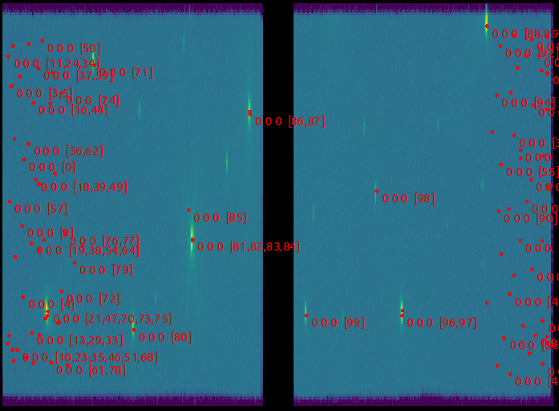
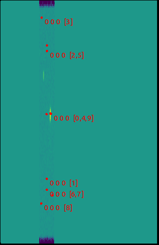
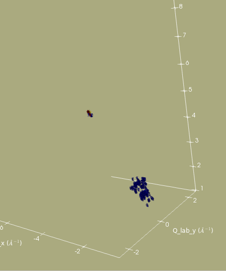
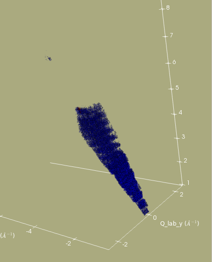
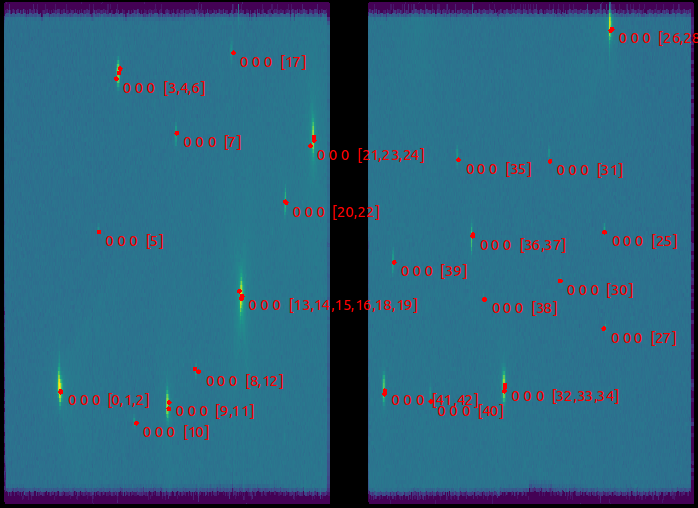
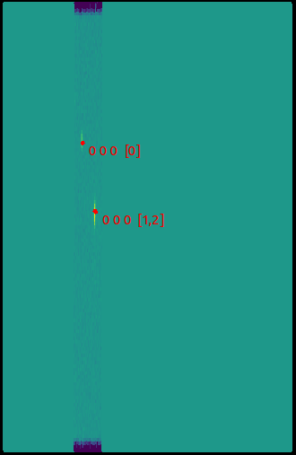

# Improving peak finding performance of `FindPeaksMD`

### Context

The `FindPeaksMD` algorithm does not show a good success rate when finding peaks
in an MD workspace. Besides discovering many false positives it also does not
find peaks of medium strength which are clearly visible in the `InstrumentView`.


### Example

##### Preparation of sample workspaces
The investigation is based on `WISH00038423`. An event workspace for it can be generated via:

```python
LoadRaw(Filename='/archive/Instruments$/NDXWISH/Instrument/data/cycle_17_1/WISH00038423.raw', OutputWorkspace='WISH00038423', LoadMonitors='Exclude')
CropWorkspace(InputWorkspace='WISH00038423', OutputWorkspace='WISH00038423', XMin=6000, XMax=99000)
ConvertToEventWorkspace(InputWorkspace='WISH00038423', OutputWorkspace='wish_event')
ConvertToDiffractionMDWorkspace(InputWorkspace='wish_event', OutputWorkspace='wish_md_event')
```

With this we can generate an MDEventWorkspace via:
```python
ConvertToDiffractionMDWorkspace(InputWorkspace='WISH00038423_qlab_event', OutputWorkspace='wish_full')
```

To get a more granular feel of the issue it is helpful to look at a cropped version of this:
```python
CropWorkspace(InputWorkspace='WISH00038423_qlab_event', OutputWorkspace='wish_event_cropped', StartWorkspaceIndex='116765', EndWorkspaceIndex='155709')
CropWorkspace(InputWorkspace='wish_event_cropped', OutputWorkspace='wish_event_cropped', StartWorkspaceIndex='5404', EndWorkspaceIndex='14877')
ConvertToDiffractionMDWorkspace(InputWorkspace='wish_event_cropped', OutputWorkspace='wish_md_event_cropped')
```

This leaves us with the workspaces `wish_event` and `wish_md_event` as well as the cropped versions `wish_event_cropped` and `wish_md_event_cropped`.


###### Finding peaks

In order to find the observed peaks we run:

```python
FindPeaksMD(InputWorkspace='wish_md_event', PeakDistanceThreshold=0.15, MaxPeaks=100, DensityThresholdFactor=10, OutputWorkspace='peaks')
FindPeaksMD(InputWorkspace='wish_md_event_cropped', PeakDistanceThreshold=0.15, MaxPeaks=10, DensityThresholdFactor=10, OutputWorkspace='peaks_cropped')
```

The peaks are plotted in the `InstrumentView` against the original event workspaces for the
full data set



and the cropped data set




The plots make the issue clear. We don't find some obvious peaks and find many which are actually not there. The result does not improve when changing the `DensityThresholdFactor` and `PeakDistanceThreshold` properties of `FindPeaksMD`


### Dissecting the problem

Inspecting the cropped data set in the `VSI` shows the following image



which shows that there is a strong peak and a lot of background counts at low q. We
expect there to be a weak peak. Indeed if we increase the top percentile and the
total number of points it appears (along with more background)



Looking at this it appears that the noise is given a too strong emphasize. The origin of this is
`getSignalNormalized` of the `IMDNode`s, ie the boxes. This returns the signal normalized by the
volume.


### Potential solution

Instead of using a volume normalization we can try and use a normalization by signal.
Changing this in the `FindPeaksMD` algorithm generates the following result, when `DensityThresholdFactor=1.2` is being used.






The performance is much better.


### Open questions

It appears that using a number-of-events-based normalization provides a better signal-strength ordering in `FindPeaksMD` than the currently used ordering scheme
based on volume normalization. This is at least true for the investigated sample data set.

The main questions are:
* Is this a valid approach for other scenarios? What is with different event types?
* What are sensible `DensityThresholdFactors`? (Or is this event still the right name for this property?)
* Should this be switchable behaviour, ie should the user be able to select the normalization beforehand?
