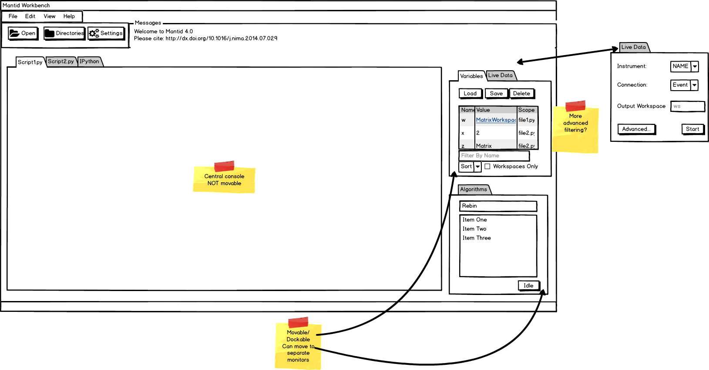
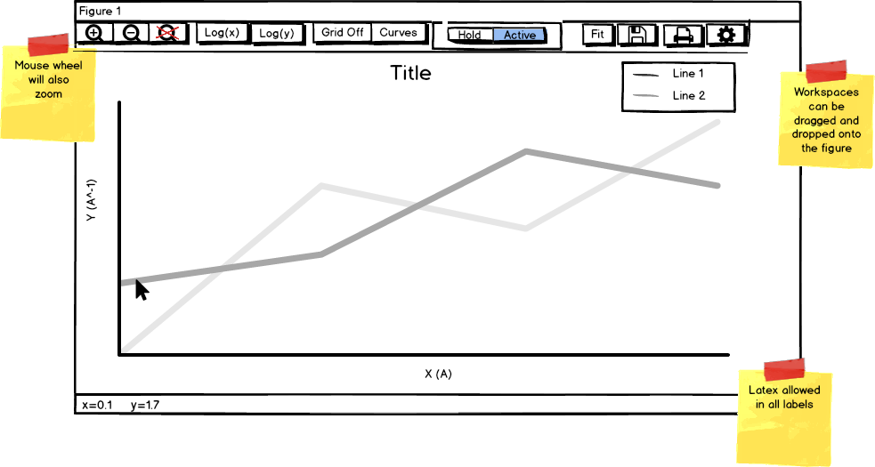
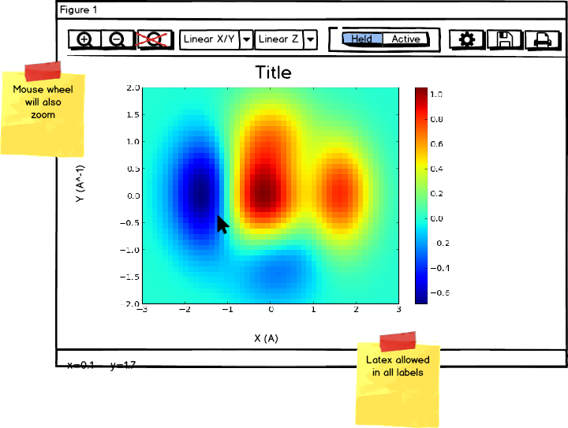

# Architecture

This document describes the architecture of the new workbench. It includes the intended design for the `mantdidqt` package.

For reference the overall layout mockup is shown here:



The central widget will be a tabbed-widget that will not be movable and 1 tab will be reserved for the embedded IPython console. It should be possible to drag an individual tab out of the window to be displayed on another monitor, for example. The controls for script execution will be in the main menu bar.

# Automated Testing

One of the most common complaints about the existing MantidPlot application is stability. We must take a proactive approach to automated testing within the new workbench. Where possible we will use common patterns such as
[MVP][mvp-fowler] to facilitate automated testing of the GUI elements and provide a better seperation of concerns within the code.

For existing code and code that would possibly be rendered more difficult to work with using MVP then the suggestion would be to supplement the pattern approach with testing via the [Qt Test][qttest] library. It allows
unit testing of Qt applications and libraries. Particularly for our existing interface/widget code this would provide some sort of automated testing that is currently lacking. This seems to be used quite successfully within
the [Jupyter Qt Console][jupyter-qtconsole], for example.

# Existing Widget Reuse

The proposal for the new workbench stated that this was not a complete rewrite of every interface/widget that we have. The following list of widgets will be "recycled" and used as is.

 - All custom interfaces with the exceptions:
 - All custom dialogs
 - All widgets in `MantidWidgets` with the exceptions:
   - fit property browser
   - workspace browser

## Qwt

Some existing widget code uses Qwt for embedded plotting and will need to be ported to work both with Qwt5 & Qwt6 (for Qt5) during the phase where we share them between MantidPlot & the new workbench. Some use it in a very
basic manner and just use an embedded canvas with no toolbars etc while others use it in a much more complex manner. To mimimise the number of places with different code for plotting we will look to port as many as is feasible
to `matplotlib` first. These will be:

 - DataComparison Interface
 - MultiDataSet Fitting
 - Instrument Viewer
 - Indirect interfaces (the plotting code is in 1 place)

The remaining interfaces will use ifdefs to compile with both Qwt5/6:

 - Slice Viewer
 - Spectrum Viewer

Over time these will migrate to `matplotlib` but not for the first release of the workbench.

### Qwt5/6

On Ubuntu for example you cannot install the development package of Qwt5 & Qwt6 together as the headers clash. To circumvent this we will use an external project to pull in the Qwt6 code and build those interfaces
against this as we migrate away. On Windows we need to build Qwt6 anyway and Homebrew is happy with the side-by-side install. Steve noted that we currently have a cmake issue with finding Qwt5 & Qw6: https://github.com/mantidproject/mantid/issues/16997

## Qt Help

The Qt Help window relies on QtWebkit to be able to render the help content. This has been removed in Qt 5.6. The HelpWindow code is small and it should be possible to keep it building
with both QtWebkit in Qt4 and QtWebEngine in Qt5 until we can remove MantidPlot.

# `mantidqt` library

This library will form the guts of the new application and will contain most of the components that will be pieced together to form the workbench. The details of the built/installed layout are:

```
mantidqt
  |-- plotting
  |   |-- cli
  |-- reduction_gui
  |-- scripting
  |-- tests # contains testing for the package
  |-- widgets
  |   |--common
  |   |  |-- _widgets.dll # sip wrapped library from C++ widgets, includes InterfaceMetaData class from above.
  |   |  |-- new_python_widget.py
  |   |-- plugins
  |   |   |-- algorithm_dialogs
  |   |-- instrumentview
  |   |   |-- tests
  |   |-- sliceviewer
  |   |   |-- tests
  |   |-- spectrumviewer
  |   |   |-- tests
  |-- __init__.py
```


## Widgets

The intention is that the workbench be comprised, as much as possible and sensible, of reusable widgets. These widgets will live in a new `mantidqt.widgets` subpackage (see [layout](design-layout.md) for it's layout within the rest of the source code). Other packages should be able reuse these widgets so they must not make an assumption about their running environment.

The current list of widgets contained within the existing [widgets][mantidwidgets] library will be resued where appropriate. Some more commonly used widgets shall be supplemeted with tests using the Qt Test framework rather than
writing them from scratch. A notable exception to this list would be the new variable explorer. As this is significantly different to the current workspace list view it would be better implemented from scratch.

### Plugins

This subpackage will contain plugins such as the algorithm dialogs. This will be loaded on demand the first time the InterfaceFactory is requested to create a dialog. This should again reduce the loading overhead.

### Instrument View/Slice Viewer/Spectrum Viewer...

These will be separate libraries so that for example another application could embed the instrument view widget. The DLLs internal to those subpackages will only be loaded when that subpackage is imported to reduce
the loading overhead and to not make users pay for features they do not use.

### Reduction Gui

This will contain the `reduction_gui` framework currently used by many customized interfaces.

### Scripting

This will contain the code related to executing scripts including a "runner" class that can execute arbitrary code, a code editor plus an in-process Qt IPython console.

## Plotting

`matplotlib` will provide the plotting abilities within the new workbench. It exposes all classes as an object-oriented API but also provides a procedural, state-machine api, `pyplot` interactive programming.

In `pyplot` matplotlib provides a default window/toolbar that provides basic tools. This will be inadequate for our users so we will develop a custom toolbar for our the 1D, 2D and 3D plot types. We will provide a `cli` module
that mimics the `pyplot` api but uses our defaults (configurable) for toolbars/window etc. Matplotlib uses a [tool][mpl-boilerplate] to generate their `pyplot` api. We can do something similar.

By providing an alternate `cli` module we can preserve access to the standard `matplotlib.pyplot` module should anyone want access to this. A snippet of code such as:

```python
try:
    import mantiqt.plotting.cli as plt
except ImportError:
    import matplotlib.pyplot as plt
```

would allow a script to function either using our cli or the built-in matplotlib one.

### 1D Plots



### 2D Plots



These figures are meant to serve as a guide and will need to be tweaked as they are developed.

### Figure Management

It is desirable within the plotting framework to have a mechanism for controlling how figures are managed. For example, when `plot` is called without specifying a window then we must make a choice of either:

 - create a new figure or
 - merge/overplot with an existing figure.

The initial propsosal is to borrow ideas from the [mslice][mslice] and have a controls on the figures so that users can indicate what is to be done with this window. In the figures above each figure contains a pair of
buttons `Hold/Active` or `Held/Active` (depending on its state). These buttons control what happens when a plotting function is called without explicit intent as to which figure it should affect.

- Hold: This window should be *frozen* and left as it is. Further plotting should be done in a new window. The text of the button changes to *Held* and the background colour to *red*.
- Active: This window is the *active* window for this plot type (separate lists maintained for 1D, 2D, 3D). Further plotting will **replace** the contents of this window. The  background colour of Active goes to  *green* and the `Held/Hold` button text is set back to *Hold* and its background back to gray.

The default state for new windows, i.e. whether held or active will be user configurable.

### Templates

Matplotlib provides a [stylesheet][mpl-stylesheets] mechanism that allows predefined styles to be applied to plots. This mechanism will be used to provide users with the ability to save a template of their plot configuration
for future use.

# Mantid Workbench

A high-level structure of the workbench package is:

```
mantidworkbench
  |-- app
  |   |-- __init__.py
  |   |-- start.py
  |   |-- mainwindow.py
  |   |-- mainmenu.py
  |   |-- splash.py
  |-- config
  |   |-- __init__.py
  |   |-- defaults.py
  |   |-- configdialog.py
  |   |-- plotting.py
  |   |-- firsttimesetup.py
  |-- + *other subpackages/classes as required*
  |-- resources.qrc
  |--__init__.py

```

## app

This subpackage is concerned with the application as a whole such as initialisation, the main window layout, menus etc. It contains the splash screen.

## config

This subpackage will be concerned with configuration. It will be responsible for creating the main tabbed configuration dialog. Any configuration pages must be provided by the packages or widgets that are being configured. For example,
the tabbed scripting interpreter will be a widget and it would be required to provide a widget that could inserted into the main configuration dialog as a complete page. For single widgets this could be done simply by requiring a `CONF_WIDGET` class attribute to point to a widget type to create:

```python
# imports...

class TabbedScriptInterpreter(QWidget):

    CONF_WIDGET = TabbedScriptInterpreterConfig

```

For other items such as plotting configuration the subpackage should provide a `CONF_WIDGET` attribute for the same affect.

This package will also contain the first time setup dialog along with the handling of any default configuration values.


<!-- Links -->
[mvp-fowler]: https://www.martinfowler.com/eaaDev/PassiveScreen.html
[qttest]: http://doc.qt.io/qt-5/qttest-index.html
[jupyter-qtconsole]: https://github.com/jupyter/qtconsole/blob/master/qtconsole/tests/test_console_widget.py
[mantidwidgets]: https://github.com/mantidproject/mantid/tree/master/MantidQt/MantidWidgets
[mslice]: https://github.com/mantidproject/mslice
[mpl-boilerplate]: https://github.com/matplotlib/matplotlib/blob/master/tools/boilerplate.py
[mpl-stylesheets]: https://matplotlib.org/users/style_sheets.html
