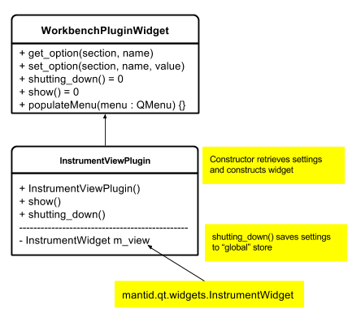

# Class/Package Level

Here we describe in more detail the piecing together of various components to build up the workbench.

# User Interface Registration

The current mechanism for user interface registration is very different between C++/Python. It is proposed that this be unified by making minor modifications to the C++ system and
extended it Python. The components are described in the following diagram:

<p align="center">
  
</p>


The `InterfaceMetadata` class separates the metadata describing a given user interface with the interface itself. Currently the `name`/`category` information
is directly attached to main window of the C++ interfaces using static methods so that the classes do not need to be instantiated on registration. At runtime
the base implementations throw an exception if they have not been overridden. In the new scheme the metadata classes are lightweight classes using pure-virtual
methods allowing this kind of missing behaviour to be detected at compile time.

The `showUI` method accepts an optional parent widget and is responsible for constructing & showing the UI itself.

By exposing the `InterfaceMetadata` and `InterfaceFactory` classes to Python we can expand this registration mechanism to encompass the Python interfaces also. This will
require minimal modification to the current startup files (see below). MantidPlot will then have single point, `InterfaceFactory` where it is able to query for
information regarding the various customized interfaces. The `InterfaceFactory::populateMenu` method will fill a given `QMenu` instance with the known list of
items without requiring external code to extract and parse stored list.

### Sample Python Metadata File

Below is an example of updating the current [HFIR powder GUI][hfir_startup_file] startup file to understand the new mechanism. It is written to be able to be started
standalone from the command line or from within MantidPlot.

```python
import sys

from HFIRPowderReduction import HfirPDReductionGUI # this requires the reduction_gui framework from mantidqt

def show():
    reducer = HfirPDReductionGUI.MainWindow() #the main ui class in this file is called MainWindow
    reducer.show()
	return reducer

if __name__ == "__main__":
    from mantidqt.utils.qt import QtGui
    qapp = QtGui.QApplication.instance() if QtGui.QApplication.instance() else QtGui.QApplication(sys.argv)
	show()
	qapp.exec_()
else:
	import mantidqt

	class HFIRPowderMetadata(mantidqt.InterfaceMetadata):

	    def name(self):
            return "HFIR Powder Diffraction Reduction"

        def category(self):
            return "Diffraction"

        def showUI(self):
            show()

    mantidqt.InterfaceFactory.subscribe(HFIRPowderMetadata)
```

**Note: This obseletes the design in [this pull request](https://github.com/mantidproject/documents/pull/40).**

# `workbench.api.plugins`

As stated in the [architecture section](design-arch.md) the workbench will be comprised mainly of widgets that are part of the `mantidqt` package. The workbench will need to configure the widgets with user
preferences but the widgets are being written into a reusable library so they should not directly control this themselves. To enable consistent configuration a thin adapter will be written inside the workbench to
integrate it and perform any additional setup the workbench requires. It will inherit a common interface: `WorkbenchPlugin`. As an example consider the current instrument widget. It exists as a standalone widget that
can be created by any application. The workbench will provide a thin adapter class as shown in the following diagram:

<p align="center">
  
</p>

that will serve to communicate with the widget. There will need to be a minor refactor to remove and internal use of `QSettings` within the widget itself. It should be the client application that controls these values not the
widget itself. The widget will simply need a constructor or setters to be able to set these values and similarly a way of retrieving them.

# `workbench.config` subpackage

This package wil contain code related to user configuration.

# `workbench.app` subpackage

This package wil contain code related to the startup, main window layout etc. It will contain the `main()` entry point that will start the application.

<!-- Links -->

[hfir_startup_file]: https://github.com/mantidproject/mantid/blob/master/scripts/HFIR_Powder_Diffraction_Reduction.py
