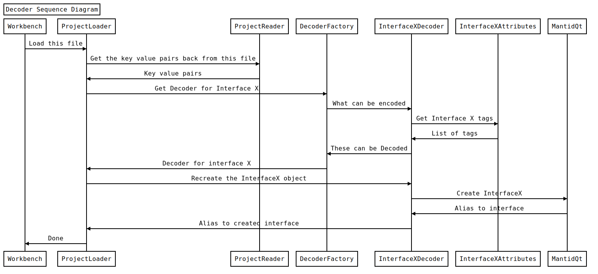

Project Saving for Mantid Workbench
==============================
Motivation
----------
In MantidPlot it was possible to save all currently open windows and all workspaces, and then be able to load then back in the exact(-ish) state that they were in previously. To achieve this goal again in Mantid Workbench, the problem will be split into two where window serialization and saving and therefore reopening will be separate in implementation, from saving workspaces.

The reason for the split is so that it can be handled in a more abstract manor. Instead of thinking of the task as one great big issue it can be split into the two smaller problems and then split further from there, later on in design.

This document exists because Project Saving is a non-trivial challenge to tackle when it comes to ideas with saving and loading interfaces created in both Python and C++ as well as saving and loading of workspaces. This issue should be fairly simple to understand, simply users should be able to save their projects and load them back in, to at least the standard that MantidPlot was able to achieve.


Functional Requirements
-----------------------
- Graceful handling of other versions that have been saved previously
- Support for both Python and C++ interfaces
- Portable across OS's
  - However gracefully handle missing files such as scripts or removed workspaces etc
- Independant File reading and writing implementation from the rest of this section of code so it can be removed and replaced without changing much else
- Ability to partially save a project as well as save it's entirity
- Be able to save and load, plots, interfaces, workspaces, workspaces interfaces and scripts.
  - Scripts only lightly and not transferrable across machines/operating systems

Changes to MantidWorkbench needed
---------------------------------
- MainWindow should track all of the open windows (as well as if they are serializable or not) similar to MantidPlot
- File->Save Project needs to be added
- File->Load Project needs to be added
- A GUI for picking where to Save

GUI and integration initial ideas
---------------------------------
It is true that this document is mostly focused on the actual implementation of saving the project and they intricacies of how that would work. However, it is important that this is discussed to some extent before hand. The intial thought process is that you would be able to do both a basic SaveAll and Save Advanced. SaveAll will run through a pretty simple Save everything as long as it's not overwriting workspaces. Save Advanced would allow the users to Select workspaces and windows individually, also adding an option as to whether or not they want to overwrite the workspaces that may or may be saved which is so at worst case users can save everything from scratch.

Options for Implementation of Workspace Saving
----------------------------------------------
**Python:**
- Pickling
	- Pros: Built in library of Python
	- Cons: Need to add _ _ getstate_ _ and _ _ setstate_ _ functions to every UI class which must return a pickle-able type (dict, list, int, string etc). Then setstate function. Unconfirmed if possible or not.
- JSON Encoding
	- Pros: Built in library of Python, "faster" than Pickling: https://www.benfrederickson.com/dont-pickle-your-data/, Potential to be integrated with C++ as it's universal
	- Cons: Needs methods in every class, doesn't integrate fully with C++ (It won't translate a C++ class into a JSON file/string without an extra library)

**C++**
- Serialization with boost 
	- Pros: We already have it, simple, uses an archive type for template serialization, has forward compatibility when classes change.
	- Cons: We need to give Friend access to each UI class for the boost::serialize::access, not python.
- Serialization with cereal
	- Pros: Very easy to implement using a template of Archive type.
	- Cons: We don't already have the cereal library, plus we'd need to cite it, as per licensing, not python.

**Both C++ and Python**
- Our own method of serialization utilizing a JSON back-end
	- Pros: We can pass C++ values to Python based serializer and back to C++, we can determine file format, we can write custom conversions for types (Most Qt types have a QVariant type conversion to JSON anyway), highly flexible
	- Cons: Requires extra work to implement that a already available library 


Implementation of save window, the recommended Method
-----------------------------------------------------
Utilizing the serializing method with a JSON back-end, will likely be best as not only will it use a standard file type, it should be easy to change the file type by changing a few functions inside the serializer. Each UI that is serializable should have a encode and decode ability where encode would create a dictionary with a string as the key and the value set to whatever object you would need to save. Decode would use the string key to get back encoder's value and emplace the original value again, and update the GUI to represent these values.

**Key points of implementation:**
- There will be an intermediary format for both save and loading, which will seperate the major sections of the code. That way each window does not have to know about JSON. A python dictionary is the most convenient type for this.
- For the types that will be saved to a project a pair of classes needs to be created: Encoder and Decoder
  - The Encoder is responsible for creating a dict of the stored settings for the type
  - The Decoder is responsible for creating the type from the dict of settings
  - Both the Encoder and Decoder can have a shared set of attributes such as shared tags
- Seperate types for encoding and decoding rather than methods on each saveable type gives multiple advantages
  - We can't have additional methods on matplotlib plots so seperate classes is actually the only way to achieve this there
  - We can write all project saving in python and expose C++ widgets to python for C++ widgets
  - Unit testing of the seperate independant peices will be more effective and less coupled together.

**Diagrams to explain Implementation operation:**
To illustrate the interface Encoder interactions I have produced this rather basic Sequence diagram to attempt to emphasise how the program should produce saved files.


The ProjectSaver class depicted should be the main class called by Workbench to perform the task of Saving. The EncoderFactory should be able to determine which Encoder's can work on what types based on passed names from the ProjectSaver which should be reciveved from the MantidQtModule.

The InterfaceXEncoder represents the Encoder that was found to encode the data from the EncoderFactory. It performs the encoding by producing a dictionary and returning it to the ProjectSaver. The InterfaceXEncoder has access to shared Attributes which are shared between the Encoder and Decoders in the form of the InterfaceXAttributes Class which can be created alongside the original two classes (Encoder and Decoder) by the implementer.

Once all the interfaces have been encoded by the found encoders, ProjectWriter is called and outputs all of the encoded information to the actual file.

To illustrate the interface Decoder intractions I have produced this rather basic Sequence diagram to attempt to emphasise how the program should utilise saved files.


The ProjectLoader class depicted should be the main class called by Workbench to perform the task of Loading. The DecoderFactory should be able to determine which Decoder's can work on what types based on passed names from the ProjectLoader which it recieves from the ProjectReader. The ProjectReader is the class that handles the reading of the file and creates the dictionary objects from the saved files. With these objects the ProjectLoader would Call the correct interface decoder from the DecoderFactory for each dictionary object, this is picked the same way encoders are picked from the EncoderFactory.

The InterfaceXDecoder represents the chosen Decoder from the DecoderFactory. The InterfaceXDecoder should decode the interface called InterfaceX. MantidQt is not nessercarily the way to create the interfaces.

**Saving:**
Utlizing an abstraction and encapsulation method we have a few major sections to tackle with a middle man "Saver Class". To save we would have the section which encompasses encoding. These sections are encoding, clumping encoded pieces together ("Saver") and writing, similar to how MVP works with GUIs. This way the encoding and writing parts will not need to touch eachother and can be swapped out independently as well as tested seperately with mocking and unit tests.

For encoding, largely this will be left up to interface implementers to prpduce the encoder and decoder classes and then register it with the factories. This will be fairly simple to do, either by hand or a more automatic approach (a more automatic approach has the unintended consequence of not allowing backwards compaitibility easily when changing variable or widget names). The proposed idea is for developers to create a InterfaceXEncoder Class where InterfaceX is the name of the Interface. This InterfaceXEncoder will be availible to the EncoderFactory which will allow developers to refactor code and be able to still load older data.

The EncoderFactory has a list of potential encoders to use and will attempt to contact each of them so that it can retrieve a availble in all encoders, list of tags that the encoder will respond to, similar to how the Load algorithm currently works. If the tag given by the EncoderFactory is present in that list of tags (The list of tags is basically a list of all names that interface has and will go by) then return that Encoder to the object that requested it.

A very basic encoder that is manually wrote may look like this:
```python
class exampleEncoder():
  def encode(self, obj):
    return_list = {}  
    return_list["name"] = "TestUI"  
    return_list["spinBox"] = obj.ui.spinBox.value()  
    return_list["lineEdit"] = obj.ui.lineEdit.text()  
    return_list["dateEdit"] = obj.ui.dateEdit.text()  
    return_list["radioButton"] = obj.ui.radioButton.isChecked()      
    return_list["checkBox"] = obj.ui.checkBox.isChecked()  
    return_list["label_7Visible"] = obj.ui.label_7.isVisible()  
    return return_list
```

The Encoder is then given the object and the resulting "middle-man" data stored as a key-value pair object will then be "clumped together" or combined and then given to the ProjectWriter which will write out that data. The way in which the ProjectWriter will do this can change depending on how the file is supposed to be written out initially it should support JSON only. This can be achieved utilizing the built in JSON module.

One problem is how the Python JSON module will represent these QTypes. Inside Qt and PyQt there is a type called QVariant which allows for constructions from the majority of Qt types and normal types, which then allows you to convert them to many formats including string and QJsonArray. However the usage of QVariant is not necessary as long as you are mostly requiring string, bool, and int. Then the JSON module will be able to convert the dictionary into a JSON string, by using json.JSONEncoder which will use this table:

 "*(Docs.python.org, 2018)*"

A basic example of how a line of JSON that may be generated from an object that uses the X function's output, the output is passed as the variable dict. Using indent=4 makes it a more human readable form when actually written out than with no indent as it would be on a single line:
```python
def json_line_from_dict(dict):  
    import json  
    return json.dumps(dict, indent=4) 
 ```

The current plan is to integrate JSON into the serializer and so it would be helpful to talk about custom objects/types. It should be easy enough to write a custom encoder. A custom encoder should be as easy as taking inheriting from json.JSONEncoder on a class and defining default(self, obj). For example:
```python
# (Docs.python.org, 2018)
class ObjectEncoder(json.JSONEncoder):
  def default(self, object):
    if isinstance(object, object_type):
      # Return an already serializable type e.g.
      return str(object_type)
    return json.JSONEncoder.default(self,object)
```

**Loading:**
Once again utilizing the same type of structure as the encoder so the symmetry between the systems allows developers to easily understand both of the systems, a 3 major part system should be used for abstraction and encapsulation, the file reading, the middle-man "Loader", and the decoding that is reproducing the objects and displaying them. Once again this allows testing and mocking of data to be easier and echoes MVP.

Tackling reading the file should be relatively easy as reading it in should be handled by the JSON module that is built into python. It has a basic load all and load line, likely better if load line is utilized similarly to how json.dumps is used. That way the key-value pair object can be reconstructed in a similar way to how it was constructed before encoding it. Then the library allows decoding for both native types and custom types.

To decode a normal type it would be a simple call to json.JSONDecoder which will utilise the following table for translating back to python objects:

 "*(Docs.python.org, 2018)*"

With these recreated key-value pairs the whole point of this is to recreate the interfaces and display them to the user, this will be handled partially by the middle-man "Loader" which will take each object recreated by the ProjectReader and find it's relevant decoder. This will be achieved by asking the DecoderFactory for the correct Decoder this will be done by passing a string that represents the name loaded in from the file, this name should be present in one of the Decoder's tag list (Very similar to the encoder tag list and should be the same value actual implementation is undefined). When the DecoderFactory finds the tag it is looking for it will pass the Decoder back to the "Loader"

Then the Loader will pass to the decoder the key-value pair object of state that is required to recreate the object and restore it's state. The best way to show this even though it will largely be left up to interface implementers to do this, is with an example:
```python
class exampleDecoder():
  def decode(self, dict):
    testui = TestUI(dict["arg1"], dict["args2"])
    testui.ui.spinBox.setValue(dict["spinBox"]) 
    testui.ui.lineEdit.setValue(dict["lineEdit"]) 
    testui.ui.dateEdit.setValue(dict["dateEdit"]) 
    testui.ui.radioButton.setValue(dict["radioButton"]) 
    testui.ui.checkBox.setValue(dict["checkBox"])
    testui.ui.label_7.setVisible(dict["label_7Visible"])
    return testui
```

Then this leaves custom Decoding from JSON to be tackled, a custom decoder is a little harder, than an encoder, as it relies on the key name when decoding being something unique to that type so would need to be on a type requirement by requirement basis. So in the JSON a programmer would need to add a _object_type_ or some other unique string to show that a type like that is there, but it's really on a per type basis. For example: 
```python
# (Docs.python.org, 2018)
def object_type(dict):
  # __object_type__ being a key that is unique to that type
  if "__object_type__" in dict:
    # Return an object of the original object type
    return object(dict["object_part1"], dict["object_part2"], dict["object_part3"])
  return dict
```

**C++ Saving and Loading Integration:**
Similarly with the C++ area of serialisation exposing most of the required details to python will be the hardest part, however if most of the interface's details are exposed properly then the decoder and encoders should be able to work exactly the same on these interfaces if only with a little extra implementation on the UI porter/maintainer's part.

Implementation of save workspaces and linking to saved scripts
--------------------------------------------------------------
Utilizing the already implemented SaveNexusProcessed, SaveMD, and SaveMask algorithms, the suggestion is to implement a python version of how MantidPlot currently implements saving workspaces. Call SaveNexusProcessed for most workspaces, SaveMD for MDWorkspaces, and SaveMask for MaskedWorkspaces. Saving a copy of the names of the saved workspace .nxs files in a JSON format in the same file as the output from the serialization of the windows, it may look like this:
```JSON
{
	workspacenames : ["workspace1", "workspace2", "workspace3", "workspace4"]
}
```
Alongside workspaces it should also carry a path to any saved scripts however when loading back in, if these scripts do not exist then fail silently as it is not overly crucial to transfer these across platforms.

Future potential optimizations
------------------------------
A workspace should only save over an already saved version of that workspace if it has changed since last save. This can be done by checking the last modified of any files with the same name as a workspace's name and then comparing it to that workspace's history for it's most recent entry. This has the caveat that no history is stored when changed manually via python.

Diagram to display overall functionality
--------------------------------
Saving starts from the GUI, and from there it passes on the selected options to the Project Saver which will in turn delegate tasks to saving workspaces and windows. The output of workspace saver and window saver are both put into the output folder.


Bibliography
------------

[1] Docs.python.org. (2018). json — JSON encoder and decoder — Python 3.7.1 documentation. [online] Available at: https://docs.python.org/3/library/json.html [Accessed 14 Nov. 2018].

[2] Bramp.github.io. (2018). js-sequence-diagrams by bramp. [online] Available at: https://bramp.github.io/js-sequence-diagrams/ [Accessed 15 Nov. 2018].

[3] Docs.python.org. (2018). 18.2. json — JSON encoder and decoder — Python 2.7.15 documentation. [online] Available at: https://docs.python.org/2/library/json.html [Accessed 15 Nov. 2018].
