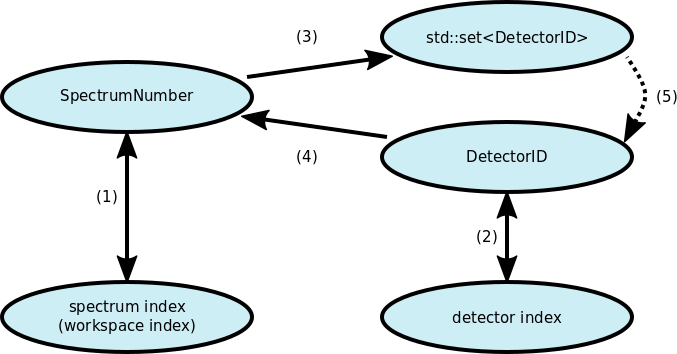

# Indexing Abstraction Layer


## Motivation

There are three main motivations for this design proposal:

1. We need to provide a consistent user interface that allows users to specify which spectra or detectors in a workspace an algorithm should modify.
2. Developers of algorithms should not have to deal with conversions between spectrum number and other index types.
3. Index handling will get *significantly* more complex in MPI-based Mantid runs and it is absolutely crucial to provide a good abstraction.


## Current situation and future problems

#### Definitions:

1. *Workspace index* = linear index starting at zero, corresponds to memory offset in vector of spectra
2. *Spectrum number* = user defined index for spectra in a certain workspace
3. *Detector ID* = user defined index for detectors in a certain instrument

For an MPI-based Mantid run we need to extend this definition:

4. *Global workspace index* = linear index starting at zero, contiguously labeling all spectra on all MPI ranks.

The definition of *workspace index* stays the same, it still gives the memory offset in the (local) vector of spectra.
That is, the workspace index is an index in the local address space of an MPI rank, the global workspace index is an index in the (imaginary) global address space.
Examples:

```bash
# Without MPI (or single MPI rank)
Spectrum number        1 2 3 7 8
Workspace index        0 1 2 3 4
Global workspace index 0 1 2 3 4

# 2 MPI ranks (interleaved distribution of spectra)
Spectrum number        1 2 3 7 8
MPI rank               0 1 0 1 0
Workspace index        0 0 1 1 2
Global workspace index 0 1 2 3 4

# 3 MPI ranks (block-wise distribution of spectra)
Spectrum number        1 2 3 7 8
MPI rank               0 0 1 1 2
Workspace index        0 1 0 1 0
Global workspace index 0 1 2 3 4
```

#### Current situation:

- Spectrum numbers are stored in their corresponding spectra.
  This implies that there are no checks on the spectrum numbers that are set, e.g., it is possible to have two spectra with the same spectrum number (the `EventWorkspace` interface seems to be doing this for certain combinations of calls to its interface methods, see [17073](https://github.com/mantidproject/mantid/issues/17073)).
- Conversion methods between index types (spectrum number and workspace index) are part of the workspace interface.
  - Maps are build on-demand from the data stored in the vector of spectra and are returned by value.
  - In many cases the spectrum number is defined as `workspace_index + offset`, typically `offset = 1`.
    This definition will break down completely in the MPI case where instead the spectrum number would be defined as `global_workspace_index + offset`.
    The global workspace index is, however, not immediately available at the level where such computations are currently done.
    Doing so would pull dependencies on MPI-related code into various places.
- There is no consistent way of defining index ranges or lists for algorithms.
  This is done individually in each algorithm, and properties may be defined for spectrum numbers or workspace indices, and sometimes the interpretation of index properties even seems to depend on the facility (`LoadEventNexus`, see [13475](https://github.com/mantidproject/mantid/issues/13475)).
- Validation of index ranges and behavior on errors such as out-of-range indices is likewise done individually in all algorithms.
  - Algorithms behave inconsistently depending on errors (throw and error, print a warning, ignore silently).
  - There are bugs in some range validations (see [15414](https://github.com/mantidproject/mantid/issues/15414)).
  - Some algorithms do not validate for duplicate spectrum numbers and double-process the corresponding spectra (see [16651](https://github.com/mantidproject/mantid/issues/16651)).
  - Validations are not unit-tested to a good extent.

The current index types and required mappings between them are illustrated in the following figure:



- (1) is the bidirectional translation between spectrum number and workspace index.
- (2) is the bidirectional translation between detector ID and detector index.
  This is not part of the current implementation, but will be used in Instrument 2.0 (see below).
- (3) is the association of a spectrum with a set of detector IDs.
- (4) gives the associated spectrum for a given detector ID.
  This is used for example when loading an event nexus file, where each event has a detector ID and needs to be added to a spectrum.
- (5) is used by certain algorithms that require a single detector for a particular spectrum.
  There are several distinct behaviors, e.g., throw if multiple detector IDs are in the set, or use the first detector.

#### Future problems:

When running Mantid with MPI we will store different spectra on different MPI ranks.
As a consequence the workspace index (as we would get it as user-input via an algorithm property) will no longer correspond to the memory offset in the local vector of spectra.
Basically we will have a global index and a local index on each rank, as exemplified above.
The local indices from all ranks are disjoint sets that together make up all global indices.

This introduces additional complexity in the index handling.
It is pretty clear that we should not and cannot put the burden of dealing with the global indexing scheme on all our (algorithm) developers.
A lot of care needs to be taken when translating between local and global indices since any mistake will lead to incorrect results that can be very hard notice and are very difficult to trace down.
It is thus absolutely crucial that this is done only in a single location in our code base and is unit tested well.

#### Instrument 2.0:

Instrument 2.0 currently under [prototype](https://github.com/DMSC-Instrument-Data/instrument-prototype) will come with MPI support as per the [design](https://github.com/DMSC-Instrument-Data/documents/tree/master/meeting_notes/April_2016/InstrumentPrototype#mpi-support).
Cleaning up our index handling is thus a prerequisite for its implementation.


## Detailed goals

- All algorithms should have a consistent interface.
- Eliminate duplicated code for declaring properties for index ranges and list.
- Eliminate duplicated code for validating indices and converting them to the desired type.
- Developers should generally not have to deal with spectrum number or detector ID at all.
  Spectrum number and detector ID are important for the user interface (or file interface), but irrelevant for the internals of most algorithms.
- Developers must be isolated from dealing explicitly with the local and global indices that come with an MPI implementation of Mantid.

## User interface

On the user-interface side it must be possible to specify certain spectra or detectors.

#### SpectrumNumbersProperty

- The interface of algorithms should make it possible to specify spectrum number ranges and lists (full range, min/max, list).
- For better compatibility for the current interface and for users who do not like to deal with spectrum numbers it should also be possible to specify workspace indices.
  It is important to note that this is a **global** workspace index.
  As explained above, in an MPI-based Mantid run this is **not** the same as the workspace index.
- Some algorithms also accept detector IDs and then identify corresponding spectrum numbers.

For developers there should be single property that provides all this:

- When declaring the property it must be possible to specify which of the index types the algorithm should accept.
- A reasonable default would be *spectrum number* and *global workspace index*.
- *Detector ID* is used in few cases and should be optional.
- The word *global* should most likely be omitted from the user interface.
  The translation from global to local workspace indices happens between the UI and the algorithm, i.e., neither the user nor (generally) the developer needs to know about global indices.
  Putting *global* in the UI would only create confusion.

#### DetectorIDsProperty

Some algorithms work directly with detectors and thus need a detector index.
This is similar to the `SpectrumNumbersProperty` but simpler.
Most likely it would be sufficient to provide only *detector ID* as possible input.

It should be pointed out that:

- Algorithms that work with *spectra* use `SpectrumNumbersProperty` to translate from a user provided *detector ID* to an *index for a spectrum* (in a workspace).
- Algorithms that work with *detectors* use `DetectorIDsProperty` to translate from a user provided *detector ID* to an *index for a detector* (in an instrument).

#### Breaking changes?

If new and consistent property naming is introduced this implies that there will be breaking changes in algorithm interfaces.
Specifically, the properties for setting, e.g., workspace indices will have different names.

There may be a few cases where larger breaks occur.
For example, [`LoadEventNexus`, issue 13475](https://github.com/mantidproject/mantid/issues/13475) seems to have an ambiguous interpretation of its inputs.


## Internals

#### New functionality

- Introduce a class that deals with translation and validation of indices.
  This will replace code that is now in `MatrixWorkspace` (translation) and in many algorithms (validation).
  Let us call this class `Translator` for the rest of this document.
  - In contrast to the current situation this can be unit tested very well.
  - Defines a consistent way of dealing with errors in the index specification.
    This is basically also part of a consistent user interface.
  - Reduces amount of code in algorithms and makes them more readable.
- Provide a convenience function or method for declaring all relevant algorithm properties in a single statement.
  - Reduces amount of code in algorithms and makes them more readable.
  - Automatically gives consistent interface.
- Spectrum numbers can be defined differently in each workspace.
  As a consequence the object dealing with translation must be linked to a workspace.
  For example, it could be a member of the workspace.
- We should make sure that we do not negatively influence performance when a trivial set of indices is specified by the user.
  Trivial can mean either the full range or a range in combination with a trivial mapping from spectrum number to workspace index (such as a simple offset of 1).
  I think our existing performance tests are in general not sensitive enough for this.
  However, it will probably be fine if we support some special cases (which are actually the most common ones):

  - We want to avoid going through a `map` or `vector` for translation in the simple cases of "full-range" (all spectra), or a simple "min-max" case.
    This is simple to do, an example can be found as part of [this pull request](https://github.com/mantidproject/mantid/pull/15465)
    I believe this will cover 95% of cases and ensure that there will be no performance hit.
  - In the other cases, when an actual list of spectra is given, I suppose that that list is commonly small (since it is often manual user input), so `map` access is negligible.
  - The remaining performance critical case is loading event data. Each event has an associated detector ID, and this needs to be translated to a workspace index.
    This is currently done by creating a `vector` (instead of a `map`) for look-up.
    We certainly have to support a similar mechanism.
    This is a case where we will need to write some performance tests, to prevent regression.
    These tests should be added well in advance so we can gather enough statistics prior to any changes and monitor the introduction of the changes.

To deal with MPI in a way that is hidden from both the user and most developers, `Translator` transforms a user input into, e.g., a `SpectrumIndexSet`.
This is best illustrated by the example from above:

```python
# User input: SpectrumNumbers='2,3,7'
indices = ws.makeSpectrumIndexSet(getProperty('SpectrumNumbers'))
```

Consider 3 cases:

```python
# Without MPI (or single MPI rank)
Spectrum number        1 2 3 7 8
Workspace index        0 1 2 3 4
Global workspace index 0 1 2 3 4
# indices contains 1,2,3

# 2 MPI ranks (interleaved distribution of spectra)
Spectrum number        1 2 3 7 8
MPI rank               0 1 0 1 0
Workspace index        0 0 1 1 2
Global workspace index 0 1 2 3 4
# rank 0: indices contains 1
# rank 1: indices contains 0,1

# 3 MPI ranks (block-wise distribution of spectra)
Spectrum number        1 2 3 7 8
MPI rank               0 0 1 1 2
Workspace index        0 1 0 1 0
Global workspace index 0 1 2 3 4
# rank 0: indices contains 1
# rank 1: indices contains 0,1
# rank 2: indices is empty
```

Algorithms then use:

```python
for index in indices:
  ws.mutableY(index) += offset
```

There are a few more complex cases.
For example, in `LoadEventNexus` a vector of events labeled by detector ID needs to be inserted into a workspace.
This requires *filtering* a vector with data based on a spectrum number of detector ID.
That is, we would not return a set of indices but a vector that is a subset of the input vector, i.e., the input vector with all data corresponding to other MPI ranks removed.

#### Implementation and effects on existing code

- Implement the `Translator` and store it in a workspace.
  Most likely it makes sense to share this between workspaces, i.e., use `Kernel::cow_ptr`, since indices change rarely after initial creation.
  As either part of the `Translator`, or as a separate entity within `MatrixWorkspace`, we will have a `Partitioning` object.
  This object is responsible for determining how data of spectra is split among MPI ranks.
  There can be several implementations of this `Partitioning` to fit the needs of various work flows.
  `Translator` uses `Partitioning` to set up its internal maps that define which spectrum numbers are present on a specific MPI rank.

- We cannot provide setters and getters for spectrum numbers and detector IDs in `Ispectrum` any more.
  Otherwise it would not be possible to maintain a consistent index map in `Translator`.

  This is likely the most critical change, since it will break existing python scripts.
  Since the fix is simple we can probably replace the existing exports by variants that print and error including a replacement suggestion, e.g., `ISpectrum::getSpectrumNo() is longer available. Replace, e.g., ws.getSpectrum(i).getSpectrumNo() with ws.getSpectrumNo(i)`.

  This point is really crucial, and it is probably necessary to consider it in a larger context.
  Follow up changes to the indexing library discussed here might require yet another change in the Python interface.
  We must avoid breaking Python scripts twice.
  That is, we need to work on a implementation/roll-out schedule in combination with other changes, in particular Instrument 2.0 and changes to the creation of workspaces that will become necessary when adding the `Translator` and `SpectrumInfo` (the latter will be part of Instrument 2.0).

- Replace or remove a series of old index mapping methods from `MatrixWorkspace`.

- Implement two new property types, `SpectrumNumbersProperty` and `DetectorIDsProperty`.
  We should also provide convenience methods to declare these properties to ensure that the properties have consistent naming across the framework.

- Refactor algorithms to use the new properties.
  This can probably done step by step and should not pose significant problems.

A very basic (but slightly outdated) example that covers some of the features described here (property declaration and range validation, but not translation from spectrum number) can be found as part of [this pull request](https://github.com/mantidproject/mantid/pull/15465).
