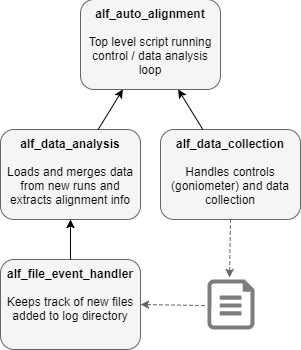

# Automated Alignment on ALF

This document contains information on the automated alignment project for ALF. The idea is to have a script that runs a data collection / data analysis loop, that automatically collects and analyses scans of a sample at different rotations until there is enough information to calculate a UB matrix, which informs the correct alignment of the sample.
This is done by way of [this Python application](linky) comprising the following elements:

Following are instructions on how to set up and run the auto alignment script.

## Parameters

There are a number of parameters that will differ from run to run and need to be set in the script (eventually by GUI)

### Data collection parameters
`rotation_initial`: what sample rotation the scan should start at
`rotation_step`: how many degrees to rotate between runs
`run_length`: data collection duration for each run in s

### Data analysis parameters

`mask_dspace_min`/ `mask_dspace_max`: Ignore peaks in this dspacing range - used to filter out noise from the sample holder. Depends on the material of the sample holder.

Peakfinding parameters (passed to FindSXPeaks):
`background_intensity`: threshold above which a signal is considered a peak. 
`resolution_tof`: time of flight resolution - minimum distance in time of flight between two peaks for them to be considered distinct
`resolution_phi`: phi resolution - minimum horizontal angle between two peaks for them to be considered distinct
`resolution_phi`: two theta resolution - minimum vertical angle between two peaks for them to be considered distinct

`merge_tolerance`: minimum distance in Q for two peaks to be considered distinct. Removes duplicates when merging peaks from different (overlapping) runs.

Lattice parameters of the sample (the users should know the values for these) - `a`, `b`, `c`, `alpha`, `beta`, `gamma`. These values are passed to the `FindUBUsingLatticeParameters` algorithm.

## Setup

To run the data collection / data analysis control loop, the application needs access to both the MantidPython and Genie_Python libraries. One way to achieve this is to bundle genie_python with mantid-install:

1. Update genie python on the machine by running 
  `\\isis\inst$\Kits$\External\BuildServer(ndwvegas)\genie_python\genie_python_install.bat`
2. Run [configure_mantid_genie.bat](resources/configure_mantid_genie.bat)
  This moves genie_python and its dependencies to the mantid-install folder. (Check that the paths in the script are correct)
3. Install the `watchdog` module. (Instructions [here](http://pythonhosted.org/watchdog/installation.html))
  This is used to monitor the file system for new data to be analyzed after a run has been conducted.
4. Move the Script[linky] to `\scripts\ALF_auto_alignment\`
  
After this is done, you should be able to run the alignment script by passing it as an argument to the `mantidpython.bat` in the mantid-install folder, i.e.:

`> C:\Mantid-install\bin\mantidpython.bat --classic .\scripts\ALF_auto_alignment\alf_auto_alignment.py`

## TODO LIST:
The script is a work in progress and possibly not very useful in its current form. Here is a To-Do list of essential tasks:
- Produce some kind of output (save WS?)
- Translate the UB matrix into instructions to actually align the sample (manually or via goniometer?)
- Implement functionality for predicting the positions of further peaks once two have been found. By jumping to the predicted position for the next scan, we can both cut the time the script takes to complete, and confirm (or refute) the UB matrix derived from the first two peaks.
- Confidence metrics for UB matrix
- Set actual log folder (ez)
- last angle thing (ez)
- dspacing presets (ez)
- Test extensively with different datasets