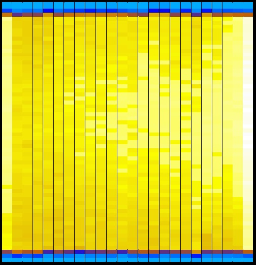
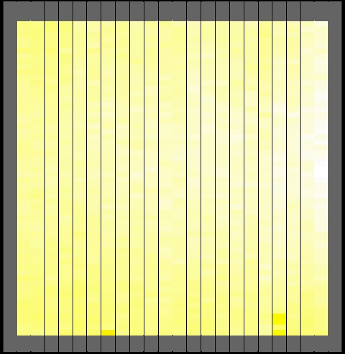
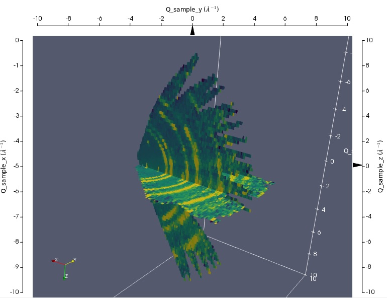

# Merged Data Visualization

This document contains information on how to create a merged visualization of data from multiple runs and at different rotations. I will first lay out the process and then walk through [this example script](resources/ALF_Visualise.py).

To perform this, you will need data from a vanadium calibration run. Vanadium scatters uniformly and thus such a run provides baseline data on the detectors used for normalisation later in the process.

## Overview of the process

1. Load vanadium calibration run. From this you can extract the following two workspaces used later by the normalisation algorithm:
    - Flux workspace: used to normalise detector counts with respect to the duration of data collection
    - Solid Angle workspace: normalises detector counts with respect to each detector's visible surface area from the sample position

Then in a loop over all runs:

2. Load the dataset and convert it to an MD workspace. This allows us to take different sample rotations into account when stitching the data, rather than simply adding the data from all the runs on top of one another.

3. Normalise the workspace and accumulate the results for all runs utilizing the flux / solid angle workspaces from step 1.

4. Create the merged, normalised workspace by dividing the accumulated detector data by the accumulated normalization data from step 3.




## Example

This script is specifically written for ALF Data, with a few hardcoded values (e.g. the detector mask), however it should be adaptable without major issues. This example script assumes that all runs contains goniometer information and are present in the folder specified at the beginning of the file. You can download the script [here.](resources/ALF_Visualise.py)

```
folder_path = "C:\Some\Log\Folder\"

xmin='-10'
xmax='10'
ymin='-10'
ymax='10'
zmin='-10'
zmax='10'
```
These are just some variables used throughout the script - the folder where your experiment data lives and the range of Qx, Qy, Qz we want to plot. These are hardcoded here, so you might have to see which values work for your data.

#### Step 1
```
print "Loading vanadium run..."
ws_van = "ALF_Vanadium"
ws_van_max = "ALF_Vanadium_FindMax"
ws_van_sa = "ALF_Vanadium_SolidAngle"
ws_van_flux = "ALF_Vanadium_Flux"
ws_mask = "ALF_Mask"

Load(Filename= folder_path + "ALF68014.raw", OutputWorkspace = ws_van)
ConvertUnits(InputWorkspace=ws_van, Target='Momentum', OutputWorkspace = ws_van)

num_tubes = 24
tube_size = 64
# Mask top 3 and bottom 3 spectra per tube
MaskDetectors(ws_van, ','.join(['{0}-{1},{2}-{3}'.format(i*tube_size+1, i*tube_size+3, i*tube_size+62, i*tube_size+64) for i in range(num_tubes)]))
# Mask first and last tube
MaskDetectors(ws_van, '1-65, 1472-1535')
ExtractMask(ws_van, OutputWorkspace=ws_mask)

# Crop undefined detectors
CropWorkspace(InputWorkspace=ws_van, StartWorkspaceIndex=0, EndWorkspaceIndex=1535, OutputWorkspace = ws_van)

```
Here we are loading the vanadium run and processing it by cropping detectors that are not defined in the instrument definition, and masking the detectors around the edges which distort the counts. (The below images show the instrument before and after masking). We are extracting the mask so we can apply it to all runs we subsequently want to visualize, as they share the same detector geometry.
```
# Find bounds for momentum range
ws_van_max = Rebin(InputWorkspace=ws_van, Params="0,0.05,20")
ws_van_max = ConvertToPointData(ws_van_max)
ws_van_max = SumSpectra(ws_van_max)
ys = ws_van_max.readY(0)

# Momentum value threshold is one tenth of peak
threshold = ys.max(axis=0) / 10

# Get lower and upper index with value above threshold
lower = ys.searchsorted(threshold)
upper = len(ys) - ys[::-1].searchsorted(threshold)

kmin = ws_van_max.readX(0)[lower]
kmax = ws_van_max.readX(0)[upper]
DeleteWorkspace(ws_van_max)
```
We want to crop the momentum range so the normalization and measurements correspond to the same incident flux. Here we are setting the range from the lowest to the highest momentum above the threshold, which we define as at least 10% of the counts at the peak.
```
# Create Solid Angle Workspace
Rebin(InputWorkspace = ws_van, Params = str(kmin) + "," + str(kmax-kmin) + "," + str(kmax), OutputWorkspace = ws_van_sa)

# Create Flux Workspace
Rebin(InputWorkspace = ws_van, Params = str(kmin)+',0.005,'+str(kmax), OutputWorkspace = ws_van_flux)
SumSpectra(InputWorkspace = ws_van_flux, OutputWorkspace = ws_van_flux)
IntegrateFlux(InputWorkspace = ws_van_flux, OutputWorkspace = ws_van_flux)
print "- - - - - - - - - - - - - - - - - - - -"
```
Here we are creating the Solid Angle & Flux workspaces needed for the normalization later on. The solid angle workspace is created by rebinning all events within the previously defined momentum range into a single bin (i.e. the total count in that range for that spectrum). The flux workspace is created by summing and integrating all spectra. You may want to tweak the bin size (0.005 in this case) depending on your momentum range.

#### Step 2
```

if mtd.doesExist('MDnorm_acc'):
    DeleteWorkspace('MDnorm_acc')
if mtd.doesExist('MDdata_acc'):
    DeleteWorkspace('MDdata_acc')
    
range_min = 75243
range_max = 75264
```
Here we are deciding which runs to include in the visualization, with `range_min` and `range_max` setting the lower and upper bound of the run numbers we want to visualize. We are deleting the accumulated workspaces (which are the result of the following loop) to ensure the result only contains runs from the current script execution. Skipping this step allows you to add extra runs to an already existing normalization result from previously processed runs
```
# For each sample rotation
for i in range(range_min, range_max+1):
    # Prepare dataset
    current_ws = "ALF" + str(i)
    current_md = "MD_" + current_ws
    current_mom = "Momentum_" + current_ws
    
    print "Loading Run " + str(i) + "..." 
    Load(Filename= folder_path + "ALF" + str(i) + ".raw",OutputWorkspace=current_ws)
    MaskDetectors(current_ws, MaskedWorkspace=ws_mask)
    CropWorkspace(InputWorkspace=current_ws, StartWorkspaceIndex=0, EndWorkspaceIndex=1535,OutputWorkspace=current_ws)
    
    # Set UB Matrix and goniometer information needed for merge
    SetGoniometer(Workspace=current_ws, Axis0="rrot, 0, 1, 0, 1")
    
    # Convert & Crop
    ConvertUnits(InputWorkspace=current_ws, Target='Momentum',OutputWorkspace=current_mom)
    Rebin(InputWorkspace = current_mom, Params = str(kmin)+',0.005,'+str(kmax),OutputWorkspace=current_mom)
```
We are now looping over all the runs we want to include in the visualization. At the end of this loop, we will have two workspaces with the accumulated counts and accumulated normalisation data for all processed runs. First, we are loading the workspace and processing it in the same way as the vanadium workspace above (masking & cropping). 

NOTE: I am loading the `.raw` files, as some of the nexus files in this dataset returned the error `Error in execution of algorithm LoadISISNexus: There seems to be an inconsistency in the spectrum numbers.` Hence the goniometer angle explicitly needs to be set (this is already done in the `.nxs` file). `rrot` is the name of the property containing the sample rotation in our case, this may differ for other instruments - you can look this up in the workspace sample logs.
```
    # Convert to MD
    print "Converting to MDWorkspace..."
    pars=dict()
    pars['QDimensions']='Q3D'
    pars['dEAnalysisMode']='Elastic'
    pars['Q3DFrames']='AutoSelect'
    pars['PreprocDetectorsWS']='preprDetMantid'
    pars['MinValues']=xmin+','+ymin+','+zmin
    pars['MaxValues']=xmax+','+ymax+','+zmax
    pars['SplitInto']=100
    pars['MaxRecursionDepth']=1
    pars['MinRecursionDepth']=1
    pars['InputWorkspace']=current_mom
    pars['OutputWorkspace']=current_md
    ConvertToMD(**pars)
```
Here we are converting the current run to an MD workspace. You can potentially simplify this step by using `ConvertToDiffractionMD` instead, however on `.raw` files, the Q ranges of the resulting MD workspace were ridiculously large (at least for the dataset I used).

#### Step 3
```
    # Normalise
    print "Normalise MD Workspace..."
    MDdata, MDnorm = MDNormSCD(InputWorkspace=current_md,
            AlignedDim0='Q_sample_x,'+xmin+','+xmax+',100',
            AlignedDim1='Q_sample_y,'+ymin+','+ymax+',100',
            AlignedDim2='Q_sample_z,'+zmin+','+zmax+',100',
            FluxWorkspace=ws_van_flux,
            SolidAngleWorkspace=ws_van_sa,)
   
    # Add to accumulated data / normalisation workspaces
    if mtd.doesExist('MDdata_acc'):
        MDdata_acc = MDdata_acc + MDdata
    else:
        MDdata_acc = CloneMDWorkspace(MDdata)
    if mtd.doesExist('MDnorm_acc'):
        MDnorm_acc = MDnorm_acc +  MDnorm
    else:
        MDnorm_acc = CloneMDWorkspace(MDnorm)
        
    print "Finished processing " + current_md
    DeleteWorkspace(current_mom)
    print "- - - - - - - - - - - - - - - - - - - -"
```
This is where the normalization happens. We are passing our MD workspace as well as the previously created solid angle and flux workspaces into MDNormSCD, and produce a data and normalization workspace in return. These are then added to the accumulation workspaces which we need in the final step.

#### Step 4
```

# Step 3 - Create workspace merging all normalized data
# ##########################################################
print "Creating merged normalised workspace..."

MD_merged_normalised = MDdata_acc/MDnorm_acc

print "Done."
```
Here we simply divide the accumulated data by the normalization workspace. The result is a workspace containing all the merged and normalised data for all processed runs. With my dataset, visualizing the result looks like this:



This result is also very useful for assessing the quality of the UB Matrix obtained with the [auto alignment script](ALF-Auto-Alignment.md). Load the peaks workspace containing the UB matrix obtained with said script, then overlay them on the merged & normalised workspace of the same runs in the slice viewer.
