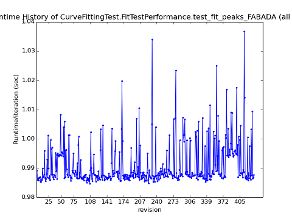

class: center, middle

# Fitting: tests for accuracy and reliability

anders @ slack

FedeMPouzols @ slack
---

# 1. Motivation

- Fitting: core

- Hot topic (SSC)

- Issues: convergence, platform dependency

- Test goodnes of fit and performance of fitting?

---

# 2. Aim

- Not trying to solve the problem, but understand

- Collect datasets, benchmark

- Diverse coverage, problems from different:
  - devs
  - areas / instruments
  - facilities

- Fitting well isolated from other steps in the reduction/analysis workflows
  
---

# 3. System and Performance tests

- System test: [WeightedLeastSquaresTest](https://github.com/mantidproject/mantid/blob/master/Testing/SystemTests/tests/analysis/WeightedLeastSquaresTest.py)
  - looking at accuracy
  - => extend the test with additional datasets or send them to us

- Performance: [CurveFittingTest](http://builds.mantidproject.org/view/All/job/master_performancetests/Master_branch_performance_tests/)
  - looking at speed
  .right[]

---

# 4. Reliability of fit

Did you know?

- Algorithm [CalculateChiSquared](http://docs.mantidproject.org/nightly/algorithms/CalculateChiSquared-v1.html)

---

# 5. Call for datasets

- Required: data to fit, function with initial values, brief explanation 

- **Your chance to have your favorite instrument/technique represented for future comparisons**
