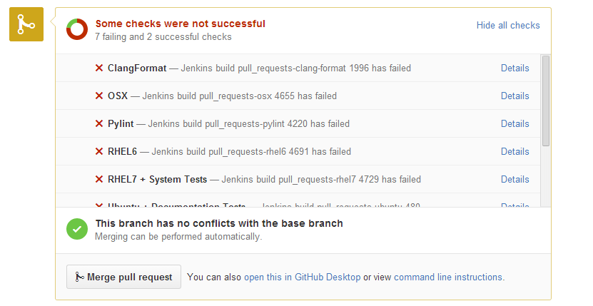
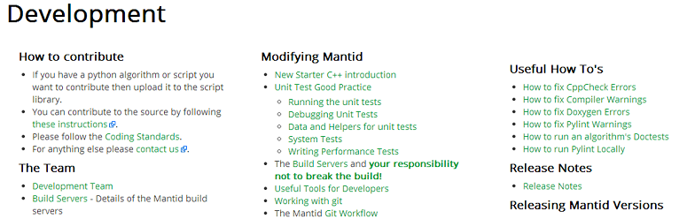
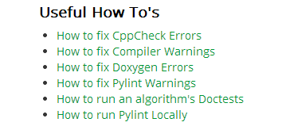
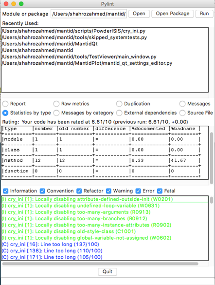
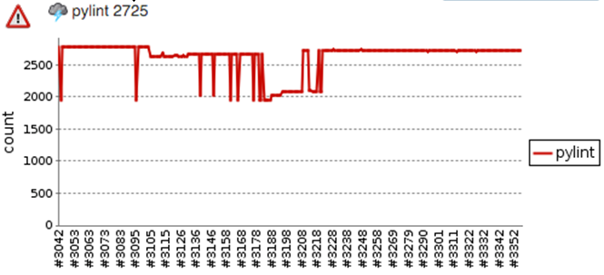
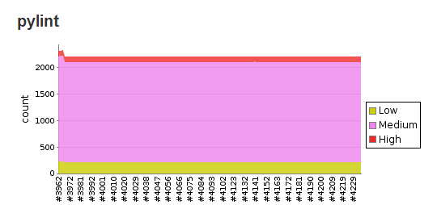

class: center, middle

# Pylint and PEP 8

help: shahroz@slack

---

# 1. Pylint is your (grumpy) friend

* Static analysis of Python code. CI automated checks
* New starters struggle
* Common cause of re-re-re...builds



---

# 2. Pylint for Mantid devs

* If your PR increases the number of violations >= threshold: red cross
* Warning: sometimes, a green tick is not enough!
* Implements much of [PEP (Python Enhancement Proposal) 8](https://www.python.org/dev/peps/pep-0008/)
* New/updated useful how-to's:



---

# 3. Install it and fix issues early

* Install it locally to speed up development
  - Windows / OS X: `pip install pylint`
  - Linux, other UXs: `yum / apt-get / pacman / etc.`

.right[]
  
* Should we include pylint with Mantid on windows?

* Examples of how to fix Pylint Warnings:

  - Proper naming conventions
  - Use of spaces, tabs, indentation, etc.

---

# 4. Running pylint locally

* IDE: PyCharm, Visual Studio, Eclipse

* Command line
```
pylint --rcfile tools/Pylint/pylint.cfg scripts/PowderISIS
```

* pylint-gui

.right[]

---

# 5. Mantid Pylint settings

* Examples (`tools/Pylint/pylint.cfg`):
  - maximum number of arguments: 5
  - length of functions: <= 150 statements. Modules: <= 1000 lines
  - function/method names: PEP 8, with length: 3-31
  - default disables: similar lines in different files

* Current: ~2200 violations in 262 files.




