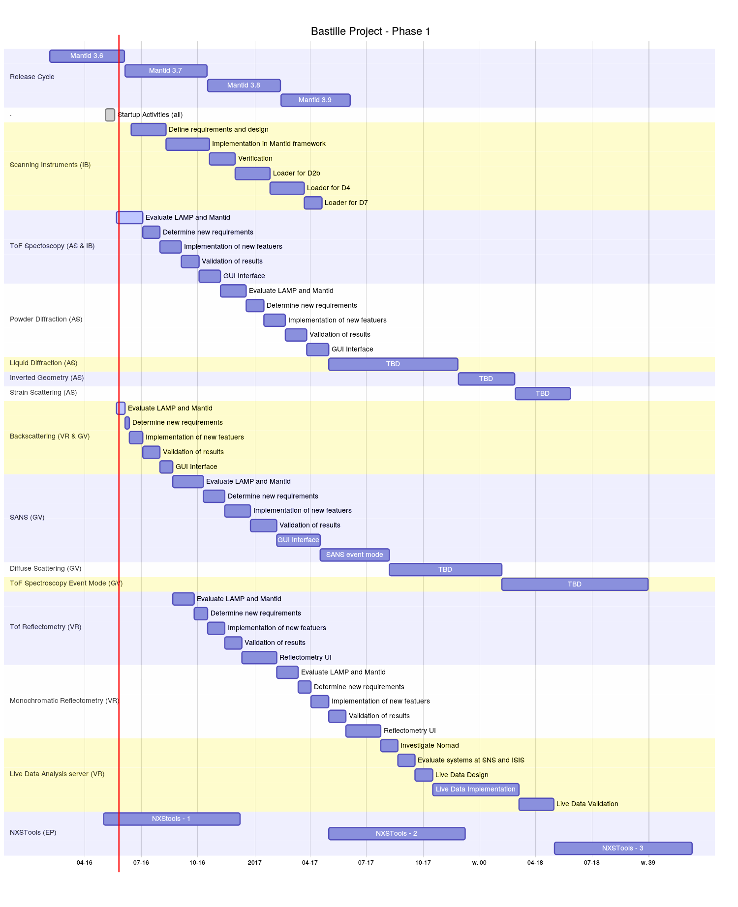

## Gantt Chart

### Creating the Chart

These Gantt charts can be generated with [mermaid](https://knsv.github.io/mermaid/). This chart was made by running the command ` mermaid bastille-gantt-mermaid.md --width 1500`.

See file [`bastille_gantt_mermaid.md`](bastille_gantt_mermaid.md) for the raw data, including the actual start dates of everything.

