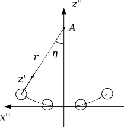
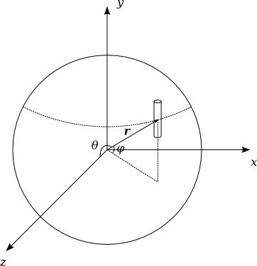
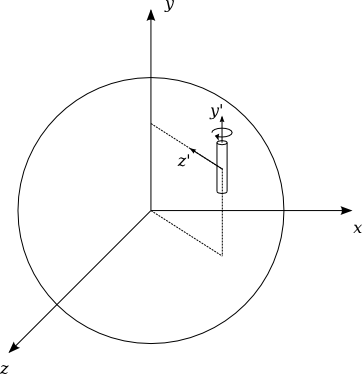
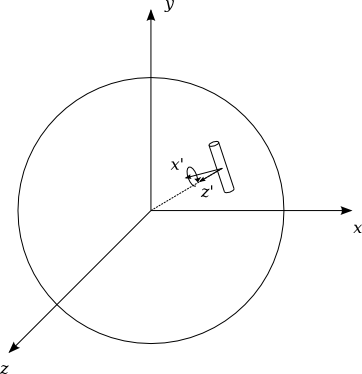
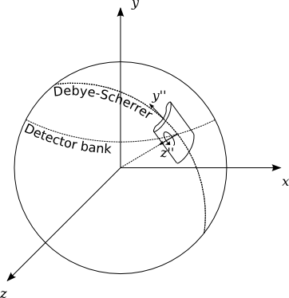
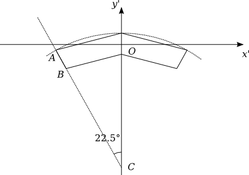
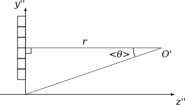
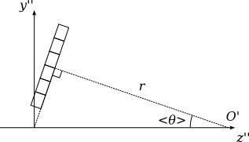

# IN4 instrument geometry

This document describes the instrument geometry of IN4 in Mantid's instrument definition file. The file is generated by a Python script.

## Coordinate systems

In this document:

* *x*, *y*, *z* -> global coordinates
* *x'*, *y'*, *z'* ->  wide-angle detector or Rosace pixel local coordinates
* *x''*, *y''*, *z''* -> wide-angle detector box or Rosace sector local coordinates

The global coordinate system used in the IN4 instrument definition is the Mantid-default right-handed system: *z* axis is in the beam direction while *y* points up. The origin is in the sample position.

## Wide-angle detectors

### Detector shape

The wide-angle detector tubes are taken as cylindrical in shape with a radius of 1.22cm (0.5mm thick tube wall taken into account) and a length of 30cm. The origin of the local detector coordinates is in the centre of the tube with *y'* axis parallel to the long axis of the cylinder.

### Detector boxes

The detector tubes are arranged in boxes of four, eight, or twelve detectors. The local arrangement of a four detector box is shown in the figure below.

**Figure 1.** *Detector box geometry.*

The boxes will eventually be positioned in the global coordinate system in such a way that point *A* in the above figure corresponds to the sample position. Thus *r* = 2m is the sample to detector distance. The difference in *&eta;* of two neighbouring detectors is 0.95&deg; within a box. The detectors are also rotated so that their local *z'* axes intersect at *A*, i.e. the detectors are facing the sample. Even thought the facing is has no practical effect for cylindrical detectors, it is still implemented if other detector shapes are required in the future.

### Detector banks

The instrument contains three detector banks. Each bank consists of detector boxes, center points of which are arranged horizontally on the surface of a sphere in the global coordinate system. One of the banks is on the same *xz* plane as the sample (the middle bank) while the two other banks are below and above it (the bottom and top banks).

While the usual cartesian coordinates are used in the instrument definition file, the coordinate system used in the generation of the banks differs somewhat from the traditional spherical coordinates. This coordinate system was chosen because it naturally describes the geometry. It is used in the IN6 IDF generator as well.

**Figure 2.** *Detector box placement into detector banks in the global coordinate system.*

In the above figure, *&theta;* is the angle between **r** and the *z* axis (the true scattering angle), and *&mu;* defines the lifting angle, the angle between the center point of a detector box and the horizontal *xz* plane.

The conversion to cartesian coordinates is given by
* *x* = *sr* (cos2 *&mu;* - cos2 *&theta;*)1/2
* *y* = *r* sin *&mu;*
* *z* = *r* cos *&theta;*

A drawback of the coordinate system is that the sign of *x* is ambiguous. Therefore, an orientation factor *s* has to be applied to the conversion above.

For IN4, *r* = 2m. The *&theta;* values for box centres in degrees are given below:

| Bank *&theta;* | Box 1 | Box 2 | Box 3 | Box 4 | Box 5 | Box 6 | Box 7 | Box 8 | Box 9 | Box 10 | Box 11 |
|----------------|-------|-------|-------|-------|-------|-------|-------|-------|-------|--------|--------|
| Middle         | 18.5  | 31.5  | 44.5  | 57.5  | 69.55 | 83.5  | 96.5  | 109.5 | 118.7 |        |        |
| Top & bottom   | 14.5  | 14.5  | 20.5  | 28.3  | 37.9  | 49.3  | 62.5  | 75.7  | 88.8  | 101.9  | 115.1  |

The *&mu;* angles are calculated from certain rotation angles given by the instrument's design documents, denoted here by *&alpha;*. The conversion formula is given by

*&mu;* = sin-1(sin *&alpha;* sin *&theta;*).

The *&alpha;* values are given below in degrees:

| Bank *&alpha;* | Box 1  | Box 2  | Box 3  | Box 4  | Box 5  | Box 6  | Box 7  | Box 8  | Box 9  | Box 10  | Box 11  |
|----------------|--------|--------|--------|--------|--------|--------|--------|--------|--------|---------|---------|
| Top            |  111.0 |  58.5  |  38.2  |  29.6  |  22.0  |  17.8  |  14.7  |  13.1  |  12.4  |  12.9   |  14.3   |
| Middle         |    0.0 |   0.0  |   0.0  |   0.0  |   0.0  |   0.0  |   0.0  |   0.0  |   0.0  |         |         |
| Bottom         | -111.0 | -58.5  | -38.2  | -29.6  | -22.0  | -17.8  | -14.7  | -13.1  | -12.4  | -12.9   | -14.3   |

The orientation factors *s* are as follows:

| Bank *s*       | Box 1 | Box 2 | Box 3 | Box 4 | Box 5 | Box 6 | Box 7 | Box 8 | Box 9 | Box 10 | Box 11 |
|----------------|-------|-------|-------|-------|-------|-------|-------|-------|-------|--------|--------|
| Middle         |  1    | 1     | 1     | 1     | 1     | 1     | 1     | 1     | 1     |        |        |
| Top & bottom   | -1    | 1     | 1     | 1     | 1     | 1     | 1     | 1     | 1     | 1      | 1      |

The formulas above are used for the initial placement of the detector boxes in the global coordinate system. This is followed by three rotations around the three local axes of the boxes. The first rotation is around the local *y''* axis and results in the boxes facing the global *y* axis as shown in the next figure (point *A* in figure 1 coincides with the *x* axis). The rotation angle is calulated as follow:

*&gamma;1* = tan-1 (*x* / *y*).

**Figure 3.** *First detector box rotation.

The second rotation, this time around the local *x''* axis results in all detectors in the box facing the sample position (point *A* in figure 1 coincides with the global origin). The rotation angle is simply *&mu;*.

**Figure 4.** *Second detector box rotation.*

The last rotation applied to the detector boxes will orient the local *y''* axes along the Debye-Scherrer rings. For this, two circles need to be defined: a Debye-Scherrer ring centre of which is on the *z* axis, and a detector bank ring which is centered on the *y* axis. Both circles intersect at a point defined by the detector bank centre position **r** as shown in the figure below.

**Figure 5.** *Third and last detector box rotation.*

After the second rotation around the local *x''* axis, the local *y''* axis of the box at **r** is on the tangent plane of the sphere defined by **r** and at 90&deg; to the tangent of the detector bank ring. We begin the last rotation by calculating a unit vector **nxz** parallel to the normal of the bank ring (omitting the orientation factor *s*):
* *x* = (cos2 *&mu;* - cos2 *&theta;*)1/2 / cos *&theta;*
* *y* = 0
* *z* = cos *&theta;* / cos *&mu;*

We also define a unit vector **txz** which is parallel to the tangent of the bank ring. Thus, it is also on the *xz* plane, orthogonal to **nxz**, and normalized to 1. From these properties we get for **txz**
* *x* = cos *&theta;* / cos *&mu;*
* *y* = 0
* *z* = (cos2 *&mu;* - cos2 *&theta;*)1/2 / cos *&mu;*

The Debye-Scherrer ring is handled similarly. We construct a unit vector **nxy** parallel to the normal of the ring:
* *x* = (cos2 *&mu;* - cos2 *&theta;*)1/2 / sin *&theta;*
* *y* = sin *&mu;* / sin *&theta;*
* *z* = 0

For the corresponding vector **txy** parallel to the tangent of the Debye-Scherrer ring we get
* *x* = sin *&mu;* / sin *&theta;*
* *y* = (sin2 *&theta;* - sin2 *&mu;*)1/2 / sin *&theta;*
* *z* = 0

Finally, the inner product between **txz** and **txy** gives

*&gamma;** = cos-1 (cos *&theta;* sin *&mu;* / (sin *&theta;* cos *&mu;*)),

as the angle between the tangents of the Debye-Scherrer and detector bank rings. This gives

*&gamma;3* = *s* *&gamma;** - *90&deg;*

as the third and last rotation angle for the detector boxes around the local *z''* axis.

## Small-angle Rosace detector

### Pixel shape

Each pixel in the Rosace detector is constructed by combining two hexahedron shapes resulting in the shape shown in the figure below.

**Figure 6.** *Rosace detector pixel geometry.*

The nominal height *AB* of each pixel is 2cm. However, the pixel heights are computed from the scattering angles for the instrument definition. This results in more accurate scattering angles but slightly differing heights for each pixel. The deviation is less than 0.3% from the nominal 2cm.

Also, the widths *BO* depend on the scattering angle.

### Sectors

The pixels are organized into sectors, each holding 12 of them. The table below lists the scattering angle *&theta;i* for pixel *i* in the sector.

|                       | Pixel 1 | Pixel 2 | Pixel 3 | Pixel 4 | Pixel 5 | Pixel 6 | Pixel 7 | Pixel 8 | Pixel 9 | Pixel 10 | Pixel 11 | Pixel 12 |
|-----------------------|---------|---------|---------|---------|---------|---------|---------|---------|---------|----------|----------|----------|
| *&theta;i* | 2.435   | 3.008   | 3.581   | 4.154   | 4.727   | 5.300   | 5.873   | 6.446   | 7.019   | 7.592    | 8.165    | 8.738    |

The geometry of a sector is based on the following assumptions on how the sector will be eventually placed:
* The centre of the sector is defined by *<&theta;>*, the average scattering angle of its pixels.
* A normal drawn from the centre point will intersect the sample position.
* The distance between the centre point and the sample *r* = 2m. 

These assumptions lead to the geometry shown in the figure below. Note that *O'* denotes the sample position in the final instrument geometry. The squares correspond to the pixel cross-sections.

**Figure 7.** *Initial Rosace sector geometry.*

These considerations give the position of the *i*th detector (point *O* in figure 6) on the *y''* axis

*yi''* = sin *&theta;i* / cos (*<&theta;>* - *&theta;i*) *r* / cos *<&theta;>*.

The pixel thickness *AB* is defined as min(*yi''* - *yi+1''*), the smallest gap between two pixels. From the knowledge of pixel thickness and *yi''*, the exact positions of the pixel corners can be calculated and the pixels positioned in their respective places in a sector.

### The entire detector

To build up the Rosace itself, first the sectors are rotated around the *x''* axis by *<&theta;>* as shown in the figure below.

**Figure 8.** *Tilting of a Rosace sector.*

Then, the sectors are rotated around the *z''* axis by *j* * 45&deg; to build the actual disk-like geometry. Here, *j* is an zero-based index running over the eight sectors. Finally, the whole detector is positioned at *z* = -*r* / cos *<&theta;>* in the global coordinates and rotated 180&deg; around the local *y* axis to face the sample.
