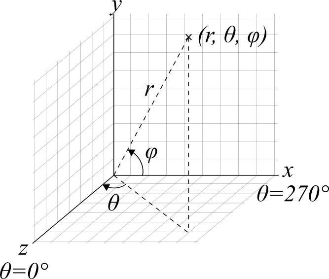

## IN6 Instrument Geometry

### Information Documents

There are three documents describing the instrument geometry - [the original design study from 1976](./IN6_DesignStudy_Scherm_1976.pdf), [an updated list from 2001 (?)](./detector_status_05_09_01.pdf) and a [document describing a correction to angles above 102 degrees](./Andersen91_IN6.pdf).

As described in an email from Bjorn Fak (22/06/2016):

> As some of us know, Ken Andersen discovered in 1991 errors in the calculated angular positions of the IN6 detectors in the report by Y. Blanc (1983). Apart from a simple typo in the detector angle at 54.53 degrees, there was a systematic error in ALL the calculated angles above 100 degrees, starting where the number of detectors per box goes from 4 to 3 (entry 84->85 in the old notation). (See attached documents [Andersen91_IN6.pdf](./Andersen91_IN6.pdf) and [IN6_DesignStudy_Scherm_1976.pdf](./IN6_DesignStudy_Scherm_1976.pdf))

> Since then, the wiring scheme has changed on IN6, but I ignore whether the boxes or their positions did change. 
Assuming they did not change, it seems to me that both errors discovered by Ken have resurfaced. Indeed, in a document distributed this week by the Bastille team [detector_status_05_09_01.pdf](./detector_status_05_09_01.pdf)) , I find two anomalies. 

> 1. The detector at 54.43 degrees (entry 53) ought to be at 54.53 degrees, otherwise the angular separation between the detectors within this box would not be 0.78 degrees (and the separation between the two adjacent 4-detector boxes not the standard 1.06 degrees). I note, however, that this angle is correctly given in the ascii raw data file (I have no means of checking the nexus file). 

> 2. There is a big gap of 1.86 degrees between entry 108 and 109, where the number of detectors per box goes from 4 to 3. As shown by Ken, this ought to be about 1.08 degrees instead, as confirmed by his high-precision measurements on 4He, as well as his inspection of the detector boxes in 1991. Hence, it appears to me that all angles above 102 degrees are again wrong. This error is also present in the ascii raw data files.

### Detector Positions

Using a right handed coordinate spherical coordinate system with r, &theta; and &phi; as shown (not used in the normal way!).

The beam direction is +z, and sample at r = 0.



Detector to sample distance is 2.483 m. There are three detector banks, lower phi = -15&deg;, middle phi = 0&deg;, and upper phi = +15&deg;.

The angles currently in the NeXus files are:
```python
[10.33, 11.11, 11.89, 12.67, 13.73, 14.51, 15.29, 16.07, 17.13, 17.91, 18.69, 19.47, 20.53, 21.31, 22.09, 22.87, 23.93, 24.71, 25.49, 26.27, 27.33, 28.11, 28.89, 29.67, 30.73, 31.51, 32.29, 33.07, 34.13, 34.91, 35.69, 36.47, 37.53, 38.31, 39.09, 39.87, 40.93, 41.71, 42.49, 43.27, 44.33, 45.11, 45.89, 46.67, 47.73, 48.51, 49.29, 50.07, 51.13, 51.91, 52.69, 53.47, 54.53, 55.31, 56.09, 56.87, 57.93, 58.71, 59.49, 60.27, 61.33, 62.11, 62.89, 63.67, 64.73, 65.51, 66.29, 67.07, 68.13, 68.91, 69.69, 70.47, 71.53, 72.31, 73.09, 73.87, 74.93, 75.71, 76.49, 77.27, 78.33, 79.11, 79.89, 80.67, 81.73, 82.51, 83.29, 84.07, 85.13, 85.91, 86.69, 87.47, 88.53, 89.31, 90.09, 90.87, 91.93, 92.71, 93.49, 94.27, 95.33, 96.11, 96.89, 97.67, 98.73, 99.51, 100.29, 101.07, 102.93, 103.71, 104.49, 105.57, 106.35, 107.13, 108.21, 108.99, 109.77, 110.85, 111.63, 112.41, 113.49, 114.27, 115.05]
```

The correct angles are:
```python
[10.33, 11.11, 11.89, 12.67, 13.73, 14.51, 15.29, 16.07, 17.13, 17.91, 18.69, 19.47, 20.53, 21.31, 22.09, 22.87, 23.93, 24.71, 25.49, 26.27, 27.33, 28.11, 28.89, 29.67, 30.73, 31.51, 32.29, 33.07, 34.13, 34.91, 35.69, 36.47, 37.53, 38.31, 39.09, 39.87, 40.93, 41.71, 42.49, 43.27, 44.33, 45.11, 45.89, 46.67, 47.73, 48.51, 49.29, 50.07, 51.13, 51.91, 52.69, 53.47, 54.53, 55.31, 56.09, 56.87, 57.93, 58.71, 59.49, 60.27, 61.33, 62.11, 62.89, 63.67, 64.73, 65.51, 66.29, 67.07, 68.13, 68.91, 69.69, 70.47, 71.53, 72.31, 73.09, 73.87, 74.93, 75.71, 76.49, 77.27, 78.33, 79.11, 79.89, 80.67, 81.73, 82.51, 83.29, 84.07, 85.13, 85.91, 86.69, 87.47, 88.53, 89.31, 90.09, 90.87, 91.93, 92.71, 93.49, 94.27, 95.33, 96.11, 96.89, 97.67, 98.73, 99.51, 100.29, 101.07, 102.15, 102.93, 103.71, 104.79, 105.57, 106.35, 107.43, 108.21, 108.99, 110.07, 110.85, 111.63, 112.71, 113.49, 114.27]
```

The 4 different detector arrangements are:

**<= 16.07&deg;** - Boxes of 4 detectors in the middle row only

**17.13&deg; to 43.27&deg;** - Boxes of 4 detectors in the middle row, 3 detectors up and lower

**44.33&deg; to 101.07&deg;** - Boxes of 4 detectors in all rows

**>= 102.93&deg;** - Boxes of 3 detectors in all rows

Spectrum numbering goes from the upper, middle, lower for a given detector angle.

### Detector Boxes

Detectors are squashed cylinders, 32 mm wide and 16 mm deep. They are 300 mm long (in detection terms). They are approximated for the instrument definition as cuboids.

Detectors are arrange in boxes of 3 or 4. The angle between detector tube centers is 0.78&deg;. This corresponds to 2.483 m * sin (0.78&deg;) = 33.80144566 mm.

For the boxes of 3 or 4 detectors the mean of the 3 or 4 detector angles is used as the position for the box, and the distance to the sample is also to this middle point. The detectors are arranged flat in the box with 33.8 mm between the tube centers.

The position of the boxes is given as:
 * x = - r sin &theta; cos &phi;
 * y = r sin &theta;
 * z = r sin &theta; cos &phi;

Rotations are then applied to give the rotation from the x-y plane to face the detector:
 * atan(x/z) (about y-axis)
 * -phi (about x-axis)

The final rotation is made to align the detector on Debye-Scherrer cone.
 * 90&deg; + acos(cot(&theta;) tan(&phi;)) (about z-axis)

### Resulting Instrument View


Here blue is z, red is x, and y is green.

The instrument view has issues with the first detector boxes in the upper and lower banks, which overlap the second detector box.


