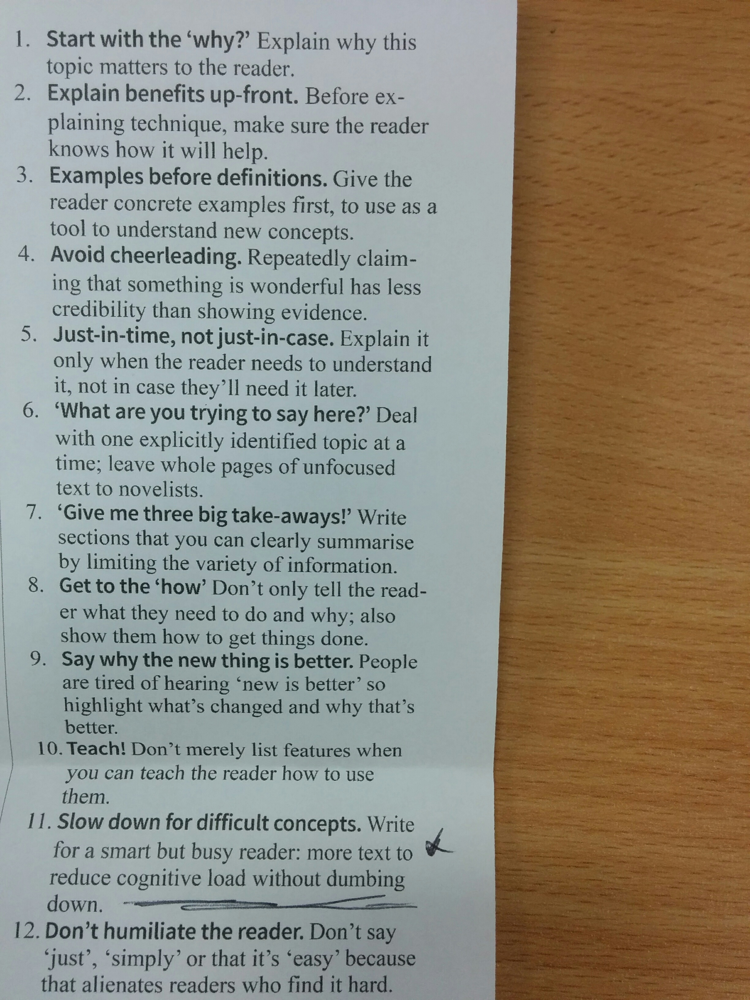
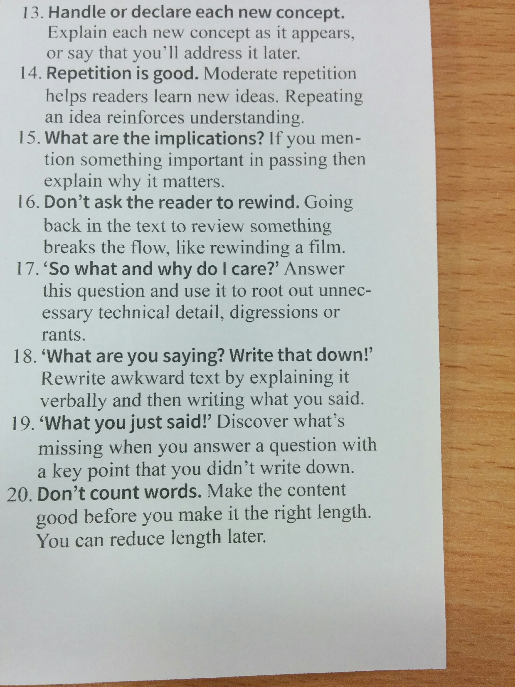

Agenda
======

* [ACCU 2017](https://conference.accu.org/site/stories/2017/schedule.html)

Highlights
----------
 - [ACCU YouTube Channel](https://www.youtube.com/channel/UCJhay24LTpO1s4bIZxuIqKw/playlists)

**C++17**
* Structured Bindings `auto [iter, success] = mymap.insert(value);`
* Selection statement with initializer `if (auto it = mymap.find(10); it != mymap.end()) { return it->size(); }`
* Library features: `std::optional`, `std::variant`, `std::any`, (`std::expected` proposal) 

**C++20**
* Metaclasses (proposal)

**Learing & Teaching Modern C++**
* C++ on Slack: http://cpplang.diegostamigni.com/
* C++ on Beta Stack Overflow documentation site: http://stackoverflow.com/documentation/c++
* Meeting C++ Blogroll: https://meetingcpp.com/index.php/blogroll.html
* isocpp.org: status of standard plus other updates

**Technical Writing Techniques**
* What defines a good README
* Tips on ways of structuring technical articles:

Questions
=========

* Are people still recording false-positive build failures? Are we acting on this information?
