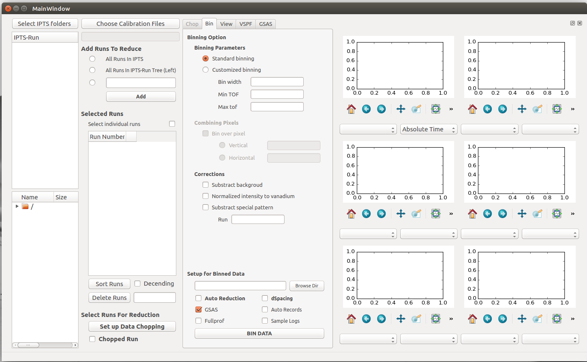
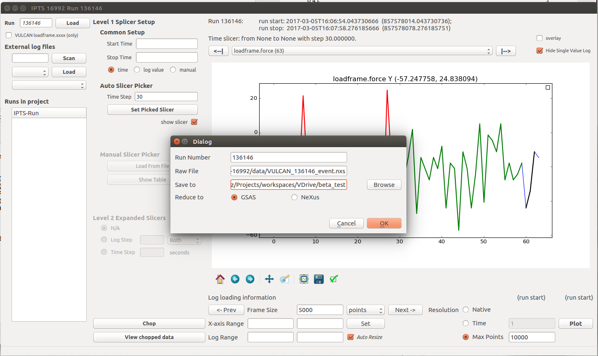
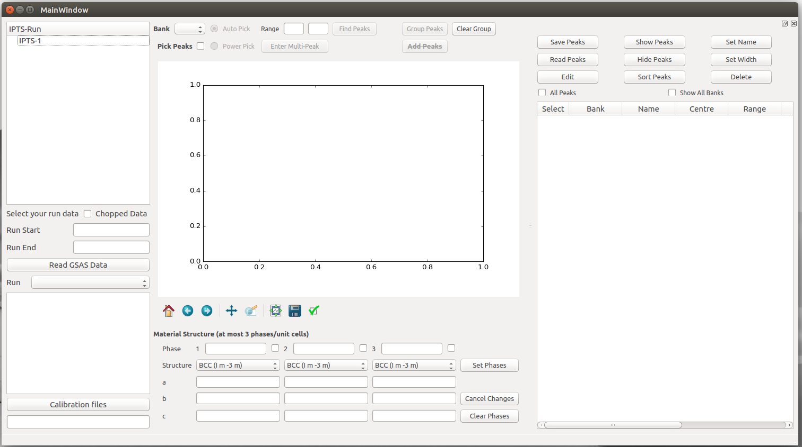
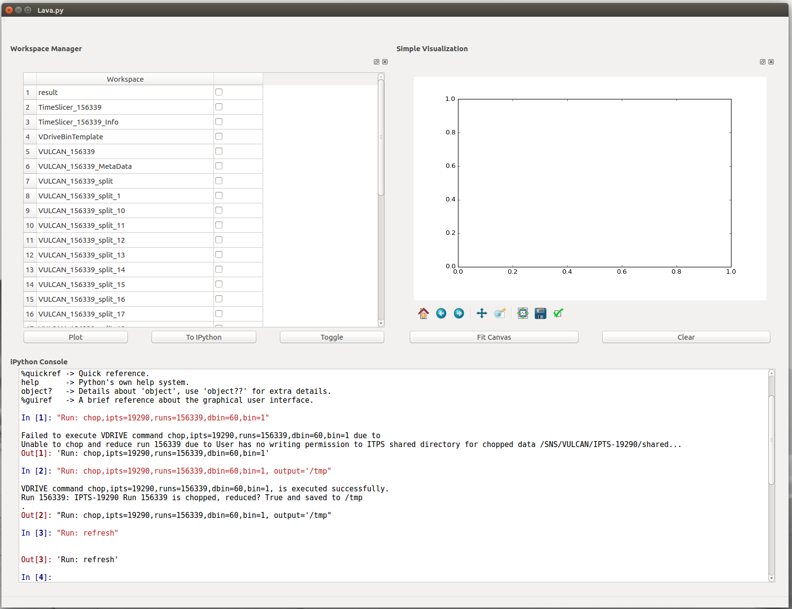
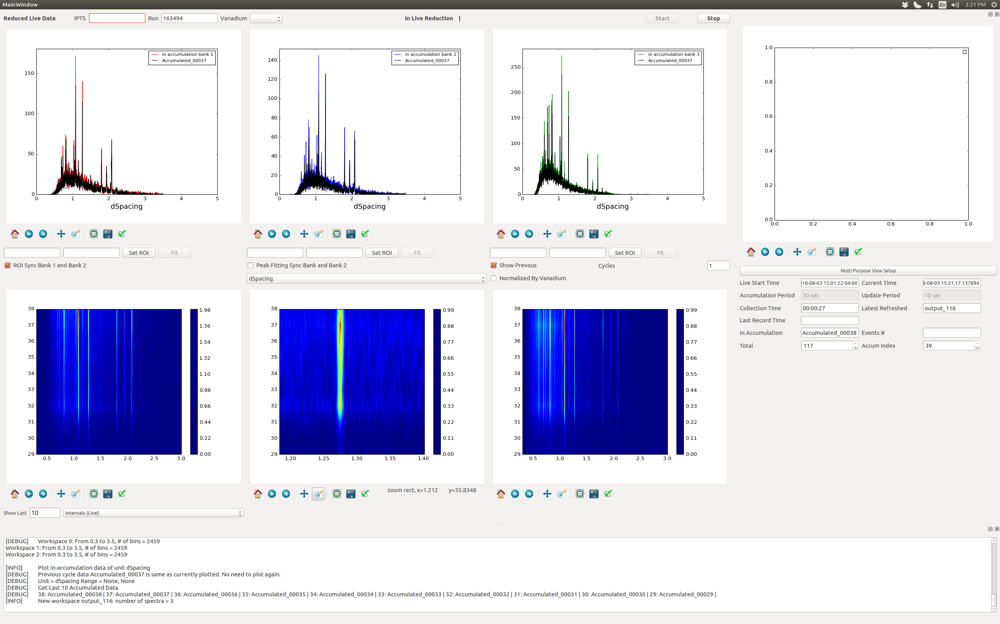

# PyVDrive

## What is PyVDrive

* [PyVDrive Repository]https://github.com/neutrons/PyVDrive)
* Data reduction (and anlaysis) software tailored for VULCAN
* Focusing on processing event based engineering diffraction data

### VDRIVE and PyVDrive

* VDrive
  * IDL-based reduction and analysis (calling GSAS) software
  * Developed by VULCAN's beamline scientist
  * Command line driven
  * Will be retired
    
* PyVDrive is going to replace VDRIVE

* PyVDrive shall have all the features that VDRIVE has and beyond

### PyVDrive and Mantid

* Mantid has all the algorithms to reduce VULCAN data

* VULCAN beamline scientists require PyVDrive to be a project outside of Mantid

* PyVDrive uses Mantid as a required library

### Requirement

* Easy to learn and use: not many returned users

* Backward compatible to VDRIVE's IDL commands

* Response time shall be comparable to IDL-based redution algorithm
    * Example: slicing a 12 hour run by every 5 mintues, doing diffraction focus on each split-out workspace and exporting to GSAS files shall be done within 5 minutes

## Features

### Reduction

* Diffraction focus
  * various choices of banks
  * various choices of binning parameters

* Slice data
  * By time
  * By sample log value
  * By user defined time intervals
  * Calling Mantid's FilterEvents and GenerateEventsFilter

### Visualization

* Compare diffraction patterns from various runs, various scans and etc
* Visualize the sample log values
* Pole figure (To be implemented soon)

### Simple analysis

It can be seen as advanced data reduction too.

* Single peak fitting
* Strain/stress calculation
* Pole figure calculation

## User interface

### GUI

* A set of child windows in order to reflect the data reduction workflow
  * Load data
  * Diffraction focus setup
  * Data slicing setup
  * Reduction result visualization
  * Single peak fitting
  
  
  
  
  
* Matplotlib is the backend for 1D and 2D plotting

### IPython console

* Extend from IPythonConsole class from Mantid

* Recognize and process all VDRIVE IDL-command

### Live-view

PyVDrive-Live-View is a standalone application inside PyDrive package for user to view the focused diffraction in realtime.

Features:
* Show the focused diffraction incrementally for each bank
* Contour plot to compare the diffraction patterns on same bank from various time period
* Trace the change of sample log values
* Simple data analysis such as peak fitting

## Next step

* Real time pole figure calculation and visualization
* Data analysis
  * Single peak fitting (GSAS/Mantid)
  * Rietveld refinement (GSAS or GSAS2)
* Combine the analysis tool with PyRS (data reduction and analysis software for HFIR HB2B)
  

