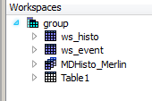
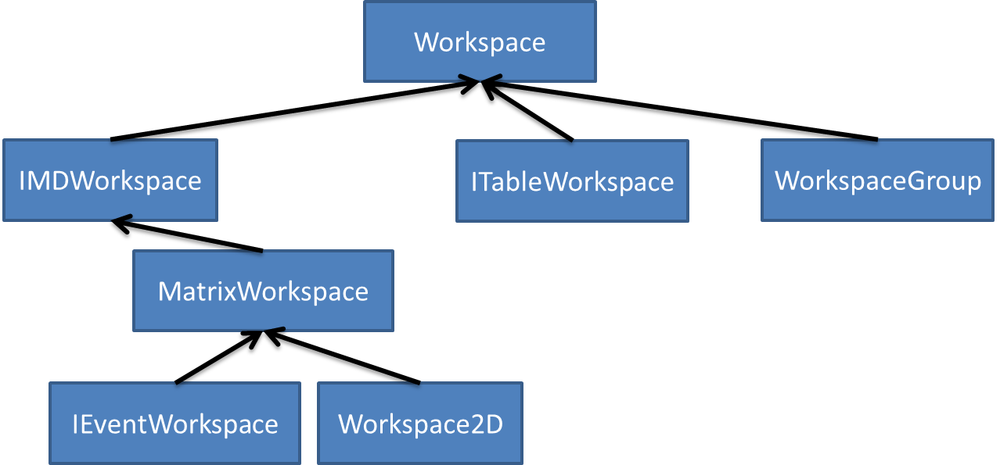

# WorkspaceGroup

## First place to look: [Concept Pages](http://docs.mantidproject.org/nightly/concepts/WorkspaceGroup.html).

Documentation says:
> A WorkspaceGroup is a group of workspaces.

Gives information on:
* grouping
* un-grouping
* expected behaviour in algorihtms

##### Creating a WorkspaceGroup
```Python
wsGroup = GroupWorkspaces([ws1, ws2, ws3])
wsGroup = GroupWorkspaces("ws1,ws2,ws3")
```

##### Un-grouping workspaces
```Python
UnGroupWorkspace(wsGroup)
# This only removes the grouping. The child workspaces are still preserved.
```


## WorkspaceGroup in the workspace taxonomy

Is a collection of arbitrary workspaces:




This means that cannot provide a lot of functionality:



#### Some WorkspaceGroup methods in C++

```Cpp
void addWorkspace (Workspace_sptr workspace);
void removeItem (const size_t index);
bool isEmpty () const;

...

void add (const std::string &wsName);
void remove (const std::string &wsName);
std::vector<std::string> getNames () const;
```

Direct exposure to ADS!!! (but also methods for non-ADS operations)

From `WorkspaceGroup.h`
> Class to hold a set of workspaces. The workspace group can be an entry in the AnalysisDataService.
    Its constituent workspaces should also have individual ADS entries.
    Workspace groups can be used in algorithms in the same way as single
   workspaces.

#### Some WorkspaceGroup methods in Python

 ```Python
remove((WorkspaceGroup)self, (str)workspace_name) -> None
add((WorkspaceGroup)self, (str)workspace_name) -> None
...
```

Intrinsically built to work with the ADS!

## Using WorkspaceGroups in Algorithms
* Algorithms which accept Workspaces properties which are not groups may in some cases still run with WorkspaceGroups. The result will be the algorithm being executed on each workspace in the group in turn.
* Algorithms which accept WorkspaceGroup do not behave like this. Any operations on the group will be handled internally as defined by the developer of the algorithm.
* Algorithms which accept WorkspaceGroup specifically will not work if a single workspace is passed.

* Algorithms which accept Workspaces properties which are not groups may in some cases still run with WorkspaceGroups. The result will be the algorithm being executed on each workspace in the group in turn.
* Algorithms which accept WorkspaceGroup do not behave like this. Any operations on the group will be handled internally as defined by the developer of the algorithm.
* Algorithms which accept WorkspaceGroup specifically will not work if a single workspace is passed.

## Interplay with ADS (Python)

Grouping and Ungrouping see above.

###### Adding and removing

*Only* via a name:
```Python
ws1 = CreateSampleWorkspace()
ws2 = CreateSampleWorkspace()
group = GroupWorkspaces([ws1])
group.add("ws2")
group.remove("ws1")
```

###### WorkspaceGroup outside the ADS

Does not seem possible purely within Python as `GroupWorkspaces` uses the `ADSValidator` on the `InputWorkspaces` field, but can have "invisible" WorkspaceGroup via loading:
``` Python
alg = AlgorithmManager.createUnmanaged("Load")
alg.initialize()
alg.setChild(True)
alg.setProperty("Filename", "WorkspaceGroup")
alg.setProperty("OutputWorkspace", "dummy")
alg.execute()
ws = alg.getProperty("OutputWorkspace").value
print("The workspace is of type {0} and contains {1} elements".format(type(ws), len(ws)))
```


###### Two references to the same object on the ADS
```Python
ws1 = CreateSampleWorkspace()
ws2 = CreateSampleWorkspace()
group = GroupWorkspaces([ws1, ws2])
group2 = GroupWorkspaces([ws1, ws2])
new_name = RenameWorkspace(group.getItem(0))

# ...
# cloned = group.clone()
# new_name = RenameWorkspace(cloned.getItem(0))
```
