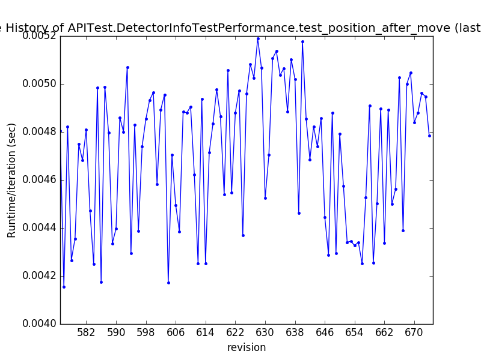
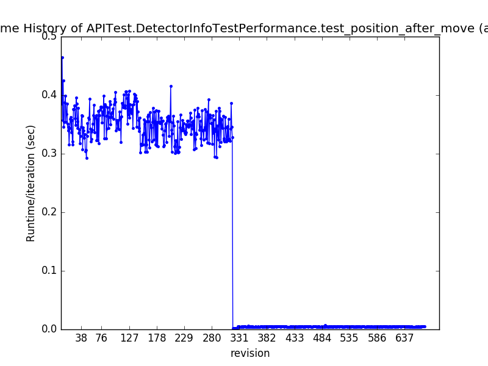

# Mantid Performance Test Improvement

## Introduction

The Mantid team uses the Jenkins continuous integration server for automatic testing and deployment of new versions of our software framework. This works in conjunction with the git version control and code management system ([github](https://github.com/)). Chief among these tests are our [performance tests](http://www.mantidproject.org/Writing_Performance_Tests) which allow is to track how changes to our code may result in improvements, or regressions, in the performance of our software. 

Changes to code are tracked using our version control system using a system of [issue tracking](https://guides.github.com/features/issues/) and creating [pull requests](https://help.github.com/articles/about-pull-requests/). Approved changes are merged into what is called the master development branch, where production-ready code lives. Each merge causes the performance tests for the codebase to be executed and the results stored in a database.

### Performance Report Generation

A python script extracts the performance data from this database and creates a full report of the history of the performance tests for individual parts of the framework. As part of the processing of the performance data, a static graph is generated for each performance test using the matplotlib library for python. These plots are the first port of call for most developers investigating the effects of changes on the performance of Mantid.

Important Files involved:

- [Performance Test ReadMe](https://github.com/mantidproject/mantid/blob/master/Testing/PerformanceTests/README.txt) (slightly outdated)
- [make_report.py](https://github.com/mantidproject/mantid/blob/master/Testing/PerformanceTests/make_report.py)
- [analysis.py](https://github.com/mantidproject/mantid/blob/master/Testing/PerformanceTests/analysis.py)
- [sqlresults.py](https://github.com/mantidproject/mantid/blob/master/Testing/PerformanceTests/sqlresults.py)

### Issues 1 (Interactivity)

Although the performance plots are very useful for diagnosing performance issues in Mantid, this could be improved. Current matplotlib plots are static and do not provide any information other than an overview of the performance history. Should a developer need to investigate performance effects further, he/she is required to consult a detailed spreadsheet (table) of each change commit to the codebase with an associated performance value. There are currently >400 tests and this number continues to grow as the codebase expands. It would be better if this information could be presented interactively on the graph. 

Below is an example of a performance test within the API module of our framework. The first plot shows the most recent commits and the second plot shows the full history of this test.

### Issue 2 (Automation)

In previous iterations of our performance test scripts, there were automatic alerts in situations where performance regressions occurred. However, due to a large number of false positives, this [script](https://github.com/mantidproject/mantid/blob/master/Testing/PerformanceTests/check_performance.py) was abandoned. Maybe this script could be revisited to provide a more robust solution for comparing performance results to determine if regressions have occurred and alert the appropriate developers.

## Possible Solution

### Plotly

[Plotly](https://plot.ly/python/) is a python library which allows for the creation of interactive online plots. A rough outline of the requirements for the online plots are as follows:

 - Should be able to zoom and pan graphs
 - Ideally Y axis should start at 0 by default
 - When hovering over graphs, the commit corresponding to the pull request which produced the performance point should be displayed as a tooltip.
 - Clicking a point on the graph should take the developer to the offending pull request which resulted in the regression.

The script [SavePlot1D.py](https://github.com/mantidproject/mantid/blob/master/Framework/PythonInterface/plugins/algorithms/WorkflowAlgorithms/SavePlot1D.py) contains an example of how to use Plotly to generate an interactive plot. There is also several online [tutorials](https://plot.ly/python/create-online-dashboard/) and [examples](https://plot.ly/python/line-charts/) for this library.

### Alert Service

The [check_performance.py](https://github.com/mantidproject/mantid/blob/master/Testing/PerformanceTests/check_performance.py) already contains most of the functionality required for the automatic alerts. Maybe the logic (thresholds and tolerances) may be a bit too strict or may require rethinking. 