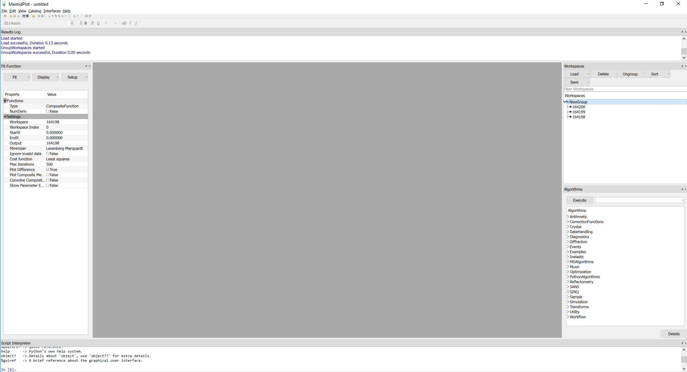
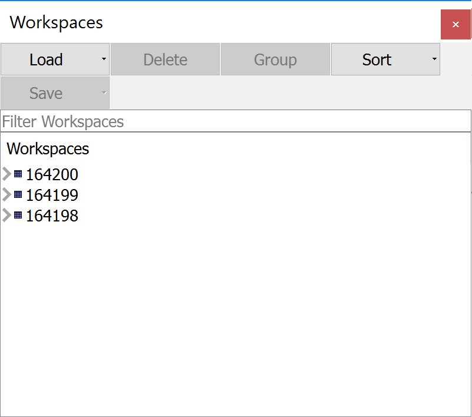

## Test Scenarios for Workspace Dock Widget 

Concepts:
 - [Workspace](http://docs.mantidproject.org/nightly/concepts/Workspace.html)
 - [Algorithm](http://docs.mantidproject.org/nightly/concepts/Algorithm.html)
 
1. **Load button in Workspace Dock**
 * **s1** - Load button used to launch load dialog, user selects valid data file and hits Run. Workspace loaded into the displayed workspace list (DWL) and the workspace name is added to the workspace dock.  
 * **s2** - Load button used to launch load dialog, user selects multiple files from the file open dialog and clicks the Run button. A group workspace is created called MultipleFiles which contains the selected workspaces.   
 * **s3** - Load button used to launch load dialog, user cancels load (Close). No interaction with DWL or workspace dock.
 * **s4** - Load button used to launch load dialog, workspace is not set by user. User selects Run. User presented with a dialog which states that one or more invalid properties (filename) have been set.
 * **s5** - User runs Load algorithm outside of workspace dock with valid data file. Workspace loaded into DWL and the workspace name is added to the workspace dock.   
2. **Group Button**
 * **s6** - User selects multiple workspaces within the workspace dock and clicks the Group button.  A group workspace called NewGroup is created which contains the selected workspaces. The workspaces are no longer displayed independently of the group.   
 * **s7** - User selects a workspace group within the workspace dock and clicks the UnGroup button. The workspace group is removed and the individual constituent workspaces are listed in the workspace dock.  
 * **s8** - User selects a group workspace and a free workspace within the workspace dock and clicks the Group button. A group workspace called NewGroup is created which contains all of the workspaces in the previous group and the free workspace. There are no subgroups. Just one new group.   
3. **Sort Button**
 * **s9** - User clicks the Sort button, then selects ascending from drop-down menu with name selected. The workspaces in the dock are sorted by name ascending.  
 * **s10** - User clicks the Sort button, then selects descending from drop-down menu with name selected. The workspaces in the dock are sorted by name descending.  
 * **s11** - User clicks the Sort button, then selects ascending from drop-down menu with last modified selected. The workspaces in the dock are sorted by last modified ascending.
 * **s12** - User clicks the Sort button, then selects descending from drop-down menu with last modified selected. The workspaces in the dock are sorted by last modified descending.
4. **Delete Button in Workspace Dock**
 * **s13** - User selects works valid workspace in workspace dock and clicks the delete button. The user is presented with a Yes/No confirmation dialog. User selects Yes. Workspace is removed from workspace dock.  
 * **s14** - User selects works valid workspace in workspace dock and clicks the delete button. The user is presented with a Yes/No confirmation dialog. User selects No. Selected workspace is not deleted from the dock.  
 * **s15** - User selects multiple workspaces in workspace dock and clicks the delete button. The user is presented with a Yes/No confirmation dialog. User selects Yes. All selected workspaces are removed from the workspace dock.  
 * **s16** - User selects a workspace which is a member of a workspace group and clicks the delete button. The user is presented with a Yes/No confirmation dialog. User selects Yes. The selected workspace is deleted from the group. The group remains but with one less workspace.  
 * **s17** - User selects the workspace in a workspace group which only contains one workspace and clicks the delete button. The user is presented with a Yes/No confirmation dialog. User selects Yes. The selected workspace and the parent group are removed from the workspace dock.  
 * **s18** - User selects a workspace from the workspace tree and an additional workspace which exists within a workspace group and clicks the Delete button. The user is presented with a Yes/No confirmation dialog. User selects Yes. The selected workspace names are removed from the workspace dock.  
5. **Save Button**
 * **s19** - With a single workspace selected, the user clicks the save button. A dropdown list appears which allows the user to select an output file type. User selects an output file type and a save file dialog is launched.
 * **s20** - With multiple workspaces selected, the user clicks the save button. A save file dialog is immediately launched.
6. **Load button for Live Data**
 * **s21** - User clicks Load Button and a dropdown list appears with the options File and Live Data. User selects Live Data and the Start Live dialog is launched.
7. **Other Actions**
 * **s22** - User right clicks workspace/group in workspace dock and selects Rename. A rename dialog is launched which prompts for the new workspace name. User enters a valid workspace name. The workspace name is updated in the DWL and the workspace dock.   
 * **s23** - User right clicks workspace/group in workspace dock and selects Rename. A Yes/No confirmation dialog is launched. The user selects Yes. The workspace is removed from the workspace dock and DWL.   